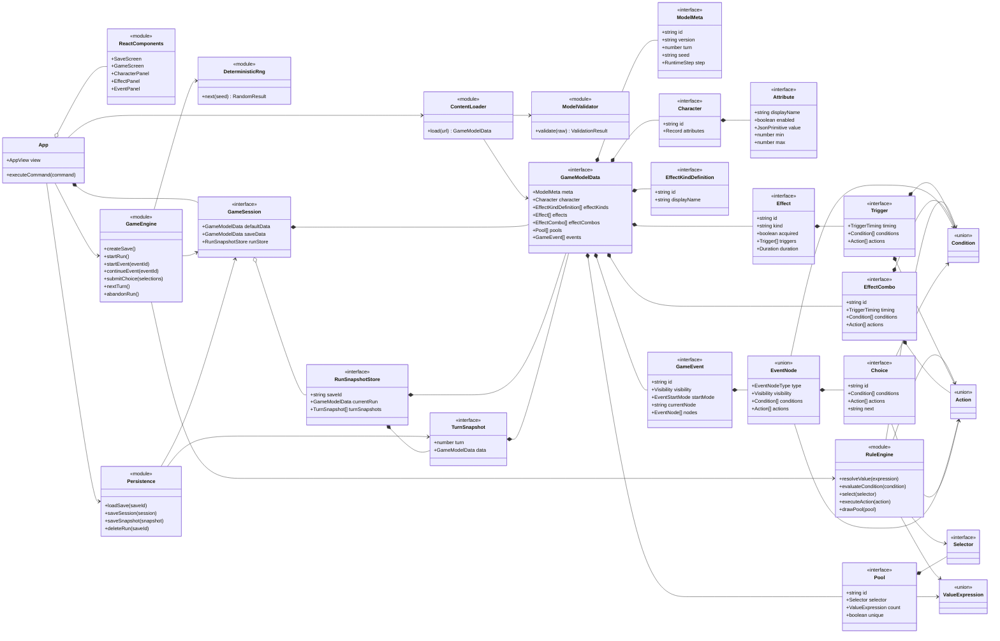
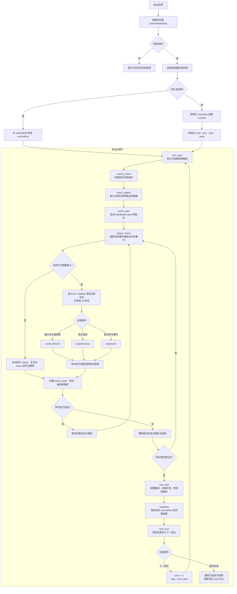

# Maker Simulator 技术规格说明

## 1. 文档目的

本文档定义当前游戏模型在浏览器端 React 应用中的实现方案。领域数据以
[`src/types/model.ts`](../../src/types/model.ts) 为类型契约，以
[`docs/system`](../system/) 中的说明为运行语义依据。

实现目标：

1. 从 JSON 加载完整游戏内容，仅修改 JSON 即可更换题材和数值。
2. 支持默认数据、玩家存档、局内动态数据三层作用域。
3. 支持效果、效果组合、候选池、条件、动作和值表达式。
4. 支持事件有向图、不同展示层级的节点、跨回合事件和玩家选择。
5. 相同模型、随机种子和玩家输入产生相同结果。
6. 每回合保存完整局内快照。

本阶段不引入服务端、账号系统、联机同步、脚本语言、可视化内容编辑器、单回合撤销或回溯。

规则来源的优先级如下：

1. `src/types/model.ts` 决定可接受的数据结构和判别联合。
2. 本文档决定应用实现和运行时行为。
3. `docs/system` 说明产品意图和模型概念。

三者发生变更时必须同步修改，不能在引擎中私自接受类型未声明的字段。

## 2. 技术约束

| 项目 | 方案 |
| --- | --- |
| 运行环境 | 现代桌面及移动浏览器 |
| UI | React 19、React DOM |
| 语言 | TypeScript |
| 构建 | Vite |
| 数据格式 | JSON |
| 持久化 | IndexedDB |
| 状态管理 | React 自有状态和纯函数游戏引擎 |
| 外部状态库 | 不使用 |
| 路由 | 当前版本不引入路由库 |

所有内容 JSON 必须满足 `GameModelData`。TypeScript 类型只提供编译期约束，外部 JSON 在进入游戏前仍必须执行运行时校验。

## 3. 总体设计

应用只划分为四个职责区域：

| 区域 | 职责 |
| --- | --- |
| 内容加载 | 获取 JSON、解析并校验 `GameModelData` |
| 游戏引擎 | 执行回合、规则、随机抽取和事件节点 |
| 持久化 | 保存玩家数据、当前局和回合快照 |
| React UI | 展示派生视图并把玩家输入转换为引擎命令 |

游戏引擎不依赖 React、DOM 或 IndexedDB。UI 不直接修改 `GameModelData`，所有修改都通过引擎命令完成。

推荐目录如下：

```text
src/
  components/
    SaveScreen.tsx
    GameScreen.tsx
    CharacterPanel.tsx
    EffectPanel.tsx
    EventPanel.tsx
  game/
    content.ts
    validation.ts
    engine.ts
    rules.ts
    rng.ts
    persistence.ts
  types/
    index.ts
    model.ts
  App.tsx
  main.tsx
```

不为每一种条件、动作或节点建立类。`rules.ts` 使用基于 `type` 的穷尽 `switch`；`engine.ts` 负责回合和事件编排。

### 3.1 类图

下图中的“类”同时表示实现模块和 TypeScript 接口，不要求把领域类型改写为面向对象实例。引擎继续使用纯函数和判别联合。



## 4. 数据所有权

### 4.1 三层模型

| 层级 | `meta.kind` | 来源 | 写入规则 |
| --- | --- | --- | --- |
| 默认数据 | `default` | 静态 JSON | 内容加载后只读 |
| 玩家存档 | `save` | 创建存档时深拷贝默认数据 | 仅局外流程或 `scope=save` 动作修改 |
| 局内数据 | `run` | 开始一局时深拷贝玩家存档 | 普通游戏动作修改 |

使用 `structuredClone` 生成各层，三层之间不得共享对象引用。

`scope` 未声明时读取或写入局内数据。运行中的 `scope=save` 修改立即写入玩家存档，但不反向同步到当前局。默认数据在应用运行时保持只读；`scope=default` 只允许在“默认数据 + 开始前选项生成存档”的预处理阶段使用，局内动作包含该作用域时视为内容错误。

创建玩家存档时设置 `kind=save`、`turn=0`、`seed=null`、`runs=0`，并移除 `step`。开始一局时设置 `kind=run`，并从局内 meta 移除仅属于存档的 `runs`。

### 4.2 顶层实体

`GameModelData` 中的数组是持久化和快照的唯一数据源：

- `effectKinds`
- `effects`
- `effectCombos`
- `pools`
- `events`

引擎执行一次命令时，可以建立 `Map<string, T>` 作为临时 ID 索引。索引不写入模型，不在 React 状态中保留，也不额外维护归一化实体仓库。

ID 规则：

1. 同一实体数组内 ID 必须唯一。
2. ID 使用稳定的 `snake_case` 字符串。
3. 已发布内容不得直接改 ID；需要改名时新增实体并迁移数据。
4. 节点 ID 只要求在所属事件内唯一，选项 ID 只要求在所属节点内唯一。

实体中的定义字段和运行状态字段保存在同一个对象中，不再拆分模板与实例：

| 实体 | 定义字段示例 | 运行状态字段示例 |
| --- | --- | --- |
| Character | `id`、属性展示名与可选边界 | 属性 `enabled`、`value` |
| EffectKindDefinition | `id`、`displayName` | 无独立运行状态 |
| Effect | `id`、`name`、`kind`、`tags`、触发器 | `unlocked`、`appeared`、`acquired`、`level`、`stacks`、`value`、`duration` |
| EffectCombo | `id`、条件、时机、动作 | `appeared` |
| Pool | ID、Selector、数量、唯一性、权重 | 无独立运行状态 |
| GameEvent | 名称、启动方式、节点图、出现规则 | `appeared`、`occurrences`、`completed`、`result`、`currentNode`、`remainingTurns`、`data` |

顶层 `effectKinds` 声明当前内容支持的全部 Effect 类型，每项包含稳定的 `id` 和 `displayName`。
Effect 的 `kind` 必须引用其中一个 ID，不由引擎固定枚举。这些值只用于内容分类、Selector 和 UI 展示，
不在引擎内产生不同的隐藏规则。玩法验证界面展示模型中的全部 Effect，并使用声明的展示名区分类型，
不因 kind 隐藏实体。

Character 的 `attributes` 在默认数据中声明内容可能使用的全部属性。每个 Attribute 包含 `displayName`、
`enabled` 和 JSON 基础值 `value`；数值属性还可声明 `min` 和/或 `max`。`enabled` 仅控制 UI 是否展示，
规则仍可读取和修改禁用属性，因此局内可通过切换它来呈现属性的动态出现。

`Duration.type` 允许 `instant`、`turns`、`permanent`。除持续时间结算外，不根据效果类型增加隐式行为。

### 4.3 应用会话

应用内存中只保留当前选择的存档及当前局：

```ts
interface GameSession {
  defaultData: GameModelData
  saveData: GameModelData
  runStore: RunSnapshotStore | null
}
```

`defaultData` 用于创建新存档和解析默认作用域读取；`saveData` 保存跨局状态；`runStore.currentRun` 是 UI 和引擎的当前局数据。

## 5. 内容加载与校验

### 5.1 内容入口

内置内容以 `docs/example/` 下的模型 JSON 作为源码，并由前端入口通过静态资源 URL 打包加载。例如：

```text
docs/example/demo2/demo2.json
```

加载流程：

1. 使用 `fetch` 获取 JSON。
2. 将响应解析为 `unknown`。
3. 调用 `validateGameModelData`。
4. 校验成功后才转换为 `GameModelData`。
5. 校验失败时显示错误页，不创建存档或启动游戏。

内容版本由 `meta.id + meta.version` 唯一标识。已有存档保存完整模型，不自动合并新版默认内容；内容升级需要显式迁移，不能按数组位置合并。属性及 Effect 类型声明属于模型结构，新增这些必填字段时必须提升内容版本，旧存档在迁移前不可载入。

### 5.2 必须阻止加载的错误

- 顶层字段缺失或字段基本类型错误。
- 实体、节点或同节点选项 ID 重复。
- `entryNode`、`currentNode`、`next`、`nexts`、`timeoutNode` 引用了不存在的节点。
- 条件、动作、节点或值表达式包含未知的判别值。
- `chance` 不在 `[0, 1]`。
- 属性值不是 JSON 基础值、非数值属性声明边界、`min > max` 或数值 `value` 不在边界内。
- Effect 的 `kind` 或 Selector 的 `kinds` 引用了未声明的 `effectKinds.id`。
- `remainingTurns`、`occurrences`、`stacks` 等计数字段为负数或非整数。
- 候选池、效果、事件等静态 ID 引用不存在。
- `aggregate !== count` 但没有 `field`。
- 数量选择中可以静态确定的上下界或步长无效。
- 不可自动离开的纯自动节点环。

无法在加载期确定的动态路径和值表达式错误，在运行时作为命令错误处理。

### 5.3 可加载但应展示的内容警告

- 事件中存在从 `entryNode` 不可达的节点。
- `choice.mode=single` 的选项没有 `next`。
- `duration.type=turns` 但 `remaining` 为 `null`。
- 已获取效果未解锁。
- 选择器使用了对当前目标无效的字段，例如事件选择器声明 `tags`。

## 6. 引擎命令与提交规则

UI 只能发出以下公共命令：

| 命令 | 作用 |
| --- | --- |
| `createSave` | 从默认数据创建玩家存档 |
| `startRun` | 从玩家存档创建当前局并开始首回合 |
| `startEvent(eventId)` | 启动一个已出现的手动事件 |
| `continueEvent(eventId)` | 确认当前交互节点并继续 |
| `submitChoice(eventId, nodeId, selections)` | 提交单选、多选或数量选择 |
| `nextTurn` | 从 `next_turn` 进入下一回合 |
| `abandonRun` | 放弃当前局并保留已明确写入 save 作用域的数据 |

每条命令按以下方式执行：

1. 对会被修改的作用域执行一次 `structuredClone`。
2. 在克隆上按数组顺序同步执行规则。
3. 任一规则失败时丢弃本次克隆，返回可定位的错误。
4. 全部成功后整体替换 React 状态并持久化。

这保证单条玩家命令不会留下部分写入，同时不提供面向玩家的撤销能力。自动节点每条命令最多连续跳转 1000 次，超过上限按节点死循环处理。

## 7. 字段路径

### 7.1 路径语法

路径使用点号分段，不支持转义点号。因此实体 ID、属性 ID 和 `data` 键不得包含 `.`。

完整模型路径示例：

```text
character.attributes.health.value
effectKinds.buff.displayName
effects.iron_sword.acquired
events.traveling_shop.data.goods.iron_sword.price
```

虽然 `effects` 和 `events` 在 JSON 中是数组，路径解析器在这两个集合后的第一段按实体 ID 查找，而不是按数组下标查找。`effectCombos` 和 `pools` 使用相同规则。普通对象继续按键读取，显式数字段可以作为数组下标。

`EffectCondition.field` 和 `ModifyEffectAction.field` 相对于目标 Effect；`EventCondition.field` 和 `ModifyEventAction.field` 相对于目标 Event。

### 7.2 临时上下文

| 路径或占位符 | 可用位置 | 含义 |
| --- | --- | --- |
| `$candidate.*` | 候选池权重表达式 | 当前候选对象 |
| `$drewId` | `draw_pool.onDraw` | 当前抽中实体 ID |
| `$selection.choiceId` | 选项动作 | 当前选项 ID |
| `$selection.quantity` | 数量选项动作 | 玩家提交的数量 |

`create_choice` 会递归替换模板中所有字符串内的 `$drewId`，之后再生成普通 `Choice`。生成结果不得残留 `$drewId`。其他临时值在动作真正执行时求值。

在 `draw_pool.onDraw` 中，`modify_effect.effectId` 或 `modify_event.eventId` 的精确值 `$drewId` 解析为当前候选 ID。其他普通动作字符串不做模板替换。嵌套抽取使用栈式上下文：内层 `$drewId` 暂时遮蔽外层，内层结束后恢复外层值。

读取不存在的路径是运行错误，不隐式返回 `undefined`。`set` 可以创建最后一级 `event.data` 字段，但其父对象必须存在；其他字段以及其他修改模式要求目标已存在。

## 8. 值表达式

普通 JSON 值直接返回。对象的 `type` 为以下保留值时，按值表达式解析：

| `type` | 规则 |
| --- | --- |
| `field` | 从指定作用域或临时上下文读取字段 |
| `calculate` | 先递归求值，再执行算术 |
| `random` | 使用当前局随机状态生成数值 |
| `aggregate_value` | 选择集合并返回聚合值 |

包含这些保留 `type` 值的普通业务对象会被当作表达式，内容 JSON 应避免这种命名冲突。

计算规则：

- `add`、`multiply`、`min`、`max` 接受一个或多个数值。
- `subtract`、`divide` 从第一项开始按顺序左结合计算。
- 参与算术的值必须为有限数值。
- 除数为 0 是运行错误。
- `random.integer=false` 返回 `[min, max)`。
- `random.integer=true` 返回包含两端的整数。
- `min > max` 是运行错误。

聚合集合为空时，`count` 和 `sum` 返回 `0`，`min`、`max`、`average` 返回 `null`。

## 9. 条件与集合选择

### 9.1 比较

条件右值先求值，再比较：

| 操作符 | 支持类型 |
| --- | --- |
| `==`、`!=` | JSON 基础值；数组和对象按引用外的深度相等比较 |
| `>`、`>=`、`<`、`<=` | 两侧均为有限数值，或两侧均为字符串 |
| `contains`、`not_contains` | 左侧为字符串或数组 |

类型不匹配不是简单的 `false`，而是内容运行错误，以便尽早暴露错误配置。

逻辑条件规则：

- `and` 按顺序短路；空数组为 `true`。
- `or` 按顺序短路；空数组为 `false`。
- `not` 表示“所有子条件合取后取反”；空数组结果为 `false`。

### 9.2 Selector

Selector 按模型数组原始顺序筛选：

1. `target` 选择 `effects` 或 `events`。
2. `ids` 是允许列表。
3. `tags` 要求效果包含列出的全部标签。
4. `kinds` 是 `effectKinds` 中已声明的效果类型 ID 列表。
5. `fields` 中的匹配规则全部满足。

非 `count` 聚合要求读取到有限数值字段。遇到不符合要求的对象时报告内容错误，不静默跳过。

## 10. 动作

### 10.1 通用修改

动作按数组顺序执行，后续动作可以读取前序动作的结果。

| `mode` | 结果 |
| --- | --- |
| `set` | `target = value` |
| `add` | `target = target + value` |
| `multiply` | `target = target * value` |
| `min` | `target = Math.min(target, value)` |
| `max` | `target = Math.max(target, value)` |

除 `set` 外，目标和求值结果必须为有限数值。`modify_attribute.field` 允许 `value` 和 `enabled`，省略时
默认为 `value`。修改 `enabled` 只能使用 `set` 写入布尔值；修改 `value` 后按 Attribute 已声明的
`min`、`max` 边界限制数值结果。`modify_effect` 和 `modify_event` 不做隐式边界限制。

### 10.2 `draw_pool`

候选池抽取顺序如下：

1. 通过 `selector` 取得候选。
2. 排除 `unlocked=false` 的实体。
3. 排除 `appeared=true` 的实体。
4. 对不可重复事件排除 `completed=true` 的实体。
5. 判断候选自己的 `appear.conditions`。
6. 执行候选自己的 `appear.chance`。
7. 在 `$candidate` 上下文计算权重，排除权重小于等于 0 的候选。
8. 求值本次 `count`，未提供时使用 Pool 的 `count`。
9. 按权重抽取，并按抽取顺序返回结果。

`count` 必须为大于等于 0 的整数。`unique=true` 使用不放回抽取，数量不足时返回全部剩余候选；`unique=false` 使用放回抽取。

Pool 本身不修改实体的 `appeared` 或 `acquired`。每个结果建立 `$drewId` 后顺序执行一次 `onDraw`。没有结果时只执行一次 `onEmpty`。

### 10.3 `create_choice`

该动作固定写入当前局：

1. 解析目标事件，未提供 `eventId` 时使用当前事件上下文。
2. 目标节点必须是 `choice`。
3. 解析源 Effect。
4. 递归替换模板中的 `$drewId`。
5. 缺失的 `id` 使用 Effect ID，缺失的 `text` 使用 Effect 名称。
6. 将生成的 Choice 追加到节点 `choices` 末尾。

生成的 Choice ID 不得与目标节点已有选项重复。需要刷新动态选项时，内容应先用 `modify_event` 将目标节点的 `choices` 设置为基础选项，再执行抽取。

## 11. 确定性随机

随机状态只保存在 `run.meta.seed`，每次消耗随机数后立即替换为下一状态，因此快照不需要额外 RNG 字段。

实现使用固定的 32 位算法：

1. 将当前 seed 的 UTF-8 字节执行 FNV-1a，得到无符号 32 位整数。
2. 使用 `next = (1664525 * state + 1013904223) mod 2^32` 推进一次。
3. 随机小数为 `next / 2^32`。
4. 新 seed 保存为 8 位小写十六进制字符串。

不得使用 `Math.random()`。以下操作会消耗随机状态：

- `0 < chance < 1` 的概率判定。
- 每次带权选择。
- `random` 值表达式。

`chance <= 0` 直接失败，`chance >= 1` 直接成功，不消耗随机状态。候选始终按模型原始顺序处理，避免对象遍历顺序改变随机结果。

## 12. 效果与效果组合

### 12.1 效果触发

只有 `acquired=true` 的 Effect 参与触发。进入一个 `TriggerTiming` 时：

1. 记录此刻已获取效果的 ID 列表。
2. 按 `effects` 数组顺序查找 timing 匹配的 Trigger。
3. 按 Trigger 数组顺序判断条件并执行动作。
4. 本时机中新获取的效果从下一个时机开始参与触发。

触发动作执行时仍会读取最新状态。

### 12.2 效果组合

效果组合在对应 `timing` 的效果触发完成后检查；`turn_start` 组合对应独立的 `combo_check` 步骤。按 `effectCombos` 数组顺序执行。

`appeared=false` 且条件满足时执行动作，成功后由引擎设置 `appeared=true`。当前模型没有重置组合状态的动作，因此每个组合在一局中最多触发一次。

### 12.3 持续时间

回合结束阶段，在 `turn_end` 触发器执行后处理已获取效果：

- `permanent`：不变。
- `instant`：设置 `acquired=false`。
- `turns`：`remaining` 减 1；减到 0 时设置 `acquired=false`。

效果失效时同时设置 `appeared=false`，保留 `level`、`stacks` 和 `value`，由内容动作决定是否重置这些字段。

## 13. 事件引擎

### 13.1 事件资格与启动

系统不隐式扫描并出现所有事件。事件出现由 `event_appear` 时机中的效果、组合或 `draw_pool` 动作驱动。

事件被设置为 `appeared=true` 后：

- `startMode=auto`：在 `event_start` 阶段自动启动。
- `startMode=manual`：进入 UI 待处理列表，等待 `startEvent`。

`GameEvent.visibility` 和 `Node.visibility` 只控制 UI 展示层级，不参与事件资格、启动、条件、动作、跳转或暂停判定：

- `foreground`：使用主要事件卡片、高对比度样式和完整文本。
- `background`：使用紧凑卡片、较弱色彩或活动记录样式，但仍然显示。

是否需要玩家输入只由节点 `type` 决定。`text`、`choice` 和需要确认的 `result` 会暂停；`check`、无确认文本的 `action` 以及节点间跳转自动执行。`visibility=background` 的 Choice 仍是合法的玩家交互，不得自动替玩家选择。

同一时间只聚焦一个需要输入的事件。已激活事件按 `events` 数组顺序优先于尚未启动的手动事件；其他事件仍以紧凑卡片显示当前状态。

启动事件时：

1. 确认事件已解锁、已出现、未激活，并满足重复规则。
2. 设置 `currentNode=entryNode`。
3. 执行 `event_start` 效果触发和组合。
4. 进入并处理入口节点。

### 13.2 进入节点的统一顺序

每次进入新节点只执行一次：

1. 设置 `currentNode`。
2. 执行 `event_node` 效果触发和组合。
3. 判断节点 `conditions`。
4. 执行节点类型逻辑；其中节点 `actions` 只执行一次。

节点条件不满足时，普通节点跳过动作并进入 `next`。没有可用 `next` 时报告内容错误。

`check` 节点是纯路由节点，不声明文本、条件、动作、`chance`、`next`、`success` 或 `failure`。进入 `check` 时按 `nexts` 数组顺序读取候选节点：候选的 `conditions` 通过且候选 `chance` 判定通过时，跳转到该候选。候选 `chance` 未声明时按 1 处理；没有候选通过时报告内容错误。被 `check` 选中的候选节点在本次进入时不重复检查 `conditions`，但会照常执行 `event_node` 时机、节点动作和节点类型逻辑。

当前节点已写入模型后，页面刷新只恢复展示，不重新执行进入动作。

### 13.3 各节点行为

| 节点 | 行为 |
| --- | --- |
| `text` | 执行动作，展示文本并等待确认 |
| `choice` | 执行动作并计算可用选项，等待玩家提交 |
| `check` | 按 `nexts` 候选节点的 `conditions` 和 `chance` 选择后续节点 |
| `action` | 执行动作；有文本时展示并等待确认，否则进入 `next` |
| `wait` | 执行一次动作后停留到回合结束处理，不允许由继续按钮越过 |
| `result` | 先写入 `event.result`，再执行动作与 `event_result` 时机 |

`completeEvent=true` 的 Result 展示后等待玩家确认，再完成事件。这样刷新页面时仍能从 `currentNode` 恢复未确认的结果文本，且 background 结果不会因自动完成而不可见。
`completeEvent=false` 的 Result 不自动完成或跳转，保持为当前节点，后续变化必须由其他规则显式修改事件状态。

完成事件时：

1. `occurrences += 1`。
2. `completed = true`。
3. `appeared = false`。
4. `currentNode = null`。
5. 保留最后一次 `result`。

`repeatable=true` 的事件即使 `completed=true` 仍可再次进入候选池；不可重复事件会被排除。
重复事件会保留 `data`、节点内动态 Choice、`remainingTurns` 和最近结果。需要重置的字段必须由内容动作明确重置。

### 13.4 Choice 提交

提交前重新判断选项条件，不能信任 UI 中先前展示的可用状态。

- `single`：必须选择一项，执行该项动作后进入选项 `next`。
- `multiple`：选择数必须满足节点的 `minSelections` 和 `maxSelections`；按 `choices` 原始顺序执行已选项动作，之后进入节点 `next`。
- `quantity`：对每个被提交选项校验 `min`、`max`、`step`，并按节点选择数限制校验已提交选项数量；每个选项动作执行一次，通过 `$selection.quantity` 读取数量，之后进入节点 `next`。

数量必须满足：

```text
min <= quantity <= max
(quantity - min) % step == 0
```

节点 `minSelections` 缺失时为 0，`maxSelections` 缺失时为可用选项数。`step` 缺失时为 1，`defaultValue` 缺失时为 `min`。多选和数量选择中不得重复提交同一 Choice ID。目标 `next=null` 时动作执行后留在当前 Choice 节点。

### 13.5 等待与超时

在 `turn_end`：

1. 对当前为 `wait` 节点的事件先判断 `endConditions`。
2. 满足时进入节点 `next`。
3. 否则将节点 `remainingTurns` 减 1。
4. 减到 0 时进入节点 `timeoutNode`。
5. 随后对每个仍处于激活状态的事件判断事件级 `endConditions`。
6. 满足结束条件或事件 `remainingTurns` 减到 0 时进入事件 `timeoutNode`。

事件级 `timeoutNode=null` 且发生超时是内容错误。事件剩余回合只对 `currentNode !== null` 的活动事件递减。

## 14. 单回合状态机

`run.meta.step` 是唯一回合阶段标记：

| 阶段 | 处理 |
| --- | --- |
| `turn_start` | 执行已获取效果的回合开始触发 |
| `combo_check` | 检查 `turn_start` 效果组合 |
| `event_appear` | 执行事件出现时机，通常由调度效果抽取事件 |
| `event_start` | 启动自动事件并推进无需输入的节点 |
| `player_event` | 展示当前交互事件、其他事件状态及待启动手动事件 |
| `event_node` | 响应确认或选择并推进节点 |
| `turn_end` | 执行回合结束触发、持续时间、等待与超时 |
| `snapshot` | 持久化完整局内快照 |
| `next_turn` | 停止自动推进，等待玩家进入下一回合 |

### 14.1 实例执行循环流程图

`visibility` 只在“渲染当前状态”时决定卡片样式，不参与任一状态跳转。Effect `kind` 同样只决定效果列表的展示样式。



开始新局时：

1. 深拷贝玩家存档。
2. 设置 `kind=run`、`turn=1`、`step=turn_start` 和新 seed，并移除 `runs`。
3. 玩家存档 `meta.runs = (meta.runs ?? 0) + 1`。
4. 自动推进到第一个玩家交互点或 `next_turn`。

调用方可以提供 seed；未提供时使用 `crypto.getRandomValues` 生成一次初始 seed，并在任何规则执行前写入 `run.meta.seed`。

`nextTurn` 仅在没有待处理交互且 `step=next_turn` 时接受。命令执行后 `turn += 1`，设置 `step=turn_start` 并继续自动推进。

事件节点需要玩家输入时，`step` 保持 `player_event` 或 `event_node`。所有当前必须处理的事件完成后，状态机继续进入 `turn_end`。

系统本身不定义胜利或失败条件。内容通过属性、效果和事件表达结束结果；当前版本提供放弃本局操作，清除当前局和快照，不隐式把 run 字段合并回 save。

## 15. 持久化

示例内容单份可达到数百 KB，连续完整快照会快速超过 `localStorage` 的常见容量，因此统一使用 IndexedDB。

数据库名：`maker-simulator`，初始版本：`1`。

| Object Store | Key | Value |
| --- | --- | --- |
| `saves` | `saveId` | 玩家存档记录及完整 `saveData` |
| `runs` | `saveId` | 当前 `GameModelData` |
| `snapshots` | `[saveId, turn]` | `TurnSnapshot` |

玩家存档记录包含少量 UI 元数据：

```ts
interface SaveRecord {
  saveId: string
  name: string
  contentId: string
  contentVersion: string
  updatedAt: string
  saveData: GameModelData
}
```

`RunSnapshotStore` 是引擎和导入导出的组合视图。读取时由 `runs` 与 `snapshots` 重建，不要求在 IndexedDB 中把整个快照数组反复写回一个记录。

持久化时机：

- 创建或修改玩家存档后写 `saves`。
- 每条成功的局内命令后更新 `runs`。
- `snapshot` 阶段用同一个事务更新 `runs` 并新增该回合快照。
- 放弃或正常结束一局后删除对应 `runs` 和 `snapshots`。

一条命令同时修改 save 和 run 作用域时，两个 Object Store 必须在同一个 IndexedDB 事务中提交。

同一回合重复写快照时以 `[saveId, turn]` 覆盖，保证幂等。存储失败时不进入下一阶段，UI 显示错误并允许重试。

## 16. React UI

### 16.1 页面状态

App 只需要以下顶层状态：

```ts
type AppView =
  | { type: 'loading' }
  | { type: 'error'; message: string }
  | { type: 'saves'; saves: SaveRecord[] }
  | { type: 'game'; session: GameSession }
```

异步命令由 `App` 调用引擎和持久化模块，成功后一次更新状态。无需 Context；只有当组件层级实际变深且 prop 传递成为问题时再引入。

### 16.2 游戏界面

`GameScreen` 包含：

- 顶部：内容名称、当前回合、当前阶段、存档状态。
- 角色区：所有 `enabled=true` 属性的展示名、当前值及可选边界。
- 事件区：当前交互节点、可用选项、手动事件列表，以及全部事件的状态概览。
- 效果区：全部效果及其 kind 展示名、解锁、出现、获取、层数、等级和剩余时间。
- 底部操作区：继续、提交选择、下一回合、放弃本局。

UI 展示数据全部从 `GameModelData` 派生，不复制 `appeared`、`currentNode`、可用选项等领域状态。数量输入和多选草稿可以保存在组件局部状态，提交后清空。

`kind` 和 `visibility` 都不得作为 UI 过滤条件。Effect kind 使用不同图标、色条或分组标题；Event 和 Node visibility 使用卡片尺寸、颜色层级和排版密度区分。locked、未出现、background 等状态可以弱化，但对应实体仍保留在玩法验证界面中。

按钮启用条件由当前阶段和节点类型决定。引擎仍必须重复校验，不能依赖按钮禁用保证合法输入。

无需输入的事件节点、条件判定和动作不弹出额外页面，但其所属事件及最新状态仍显示在事件概览中。发生内容错误时停止自动推进，显示事件 ID、节点 ID、动作或条件位置以及错误原因。

### 16.3 内容安全

事件名称、文本和选项文本都作为普通 React 文本渲染，不使用 `dangerouslySetInnerHTML`。JSON 不允许包含或执行 JavaScript。

## 17. 性能与可维护性要求

- 单条命令只深拷贝一次需要修改的模型，不在每个动作中继续深拷贝。
- ID Map 只在命令期间构建，避免同时维护数组和长期索引。
- React 列表使用领域 ID 作为 key。
- 规则分派必须使用穷尽 `switch`，新增判别联合成员时由 TypeScript 暴露未处理分支。
- 引擎错误包含 JSON 定位信息，例如
  `events.traveling_shop.nodes.prepare_shop.actions[0]`。
- 自动执行存在 1000 次节点跳转上限，避免错误内容阻塞浏览器主线程。
- 当前数据量下所有规则保持同步执行；在实际测量显示卡顿前不引入 Web Worker。

## 18. 实施顺序

1. 实现内容加载、字段路径和完整模型校验。
2. 实现确定性 RNG、值表达式、条件、Selector 和聚合。
3. 实现修改动作、候选池和动态 Choice。
4. 实现效果触发、组合与持续时间。
5. 实现事件节点执行和回合状态机。
6. 实现 IndexedDB 存档及快照。
7. 实现存档页、角色面板、事件交互和效果面板。
8. 接入 `cultivation_demo.json`，替换当前 Vite 示例页面。
