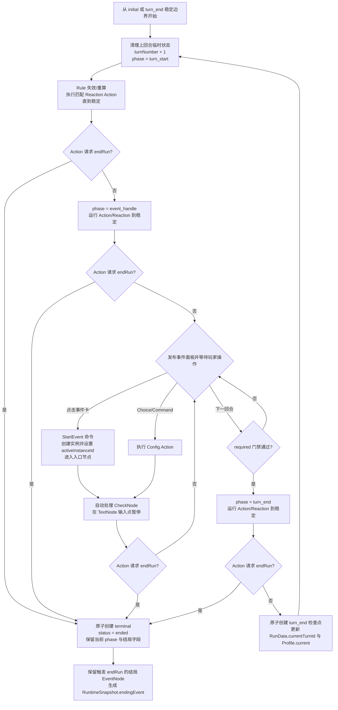

# 游戏运行时流程与 UI 绑定

本文是局级运行时编排的权威定义：说明已经完成 linking 的 `LoadedGamePackage` 如何与新建或恢复的 State 组成 GameplayRuntime，以及 UI 命令、引擎状态机、Action/Reaction 与单回合如何协作。对应公共类型见 [runtime.ts](../../src/types/runtime.ts)，包的发现与加载见[外部游戏包与加载](./game-package.md)，玩家页面与布局见[玩家流程与界面设计](./player-flow-and-ui.md)。

## 三类调用边界

| 类型 | 发起方 | 用途 | 示例 |
| --- | --- | --- | --- |
| RuntimeCommand | UI | 表达玩家意图，由引擎重新校验 | `StartEvent`、`ChooseSingle`、`AdvanceTurn` |
| internal transition | 引擎状态机 | 推进 phase、回合、EventInstance 与检查点 | 进入 `turn_start`、创建 `terminal` |
| package Action | Config/Reaction | 执行游戏包 JavaScript，修改内容 State | Choice Action、Effect Reaction Action |

三者不能通过字符串名称互相冒充。`StartEvent` 是 RuntimeCommand，不是名为 `start_event` 的 Action；自动 phase 转换不是伪造的 UI 命令；游戏包也不能通过特殊 Action key 调用 `AdvanceTurn` 或直接写阶段。Action 通过 `context.runState` 定位并修改 active EventInstance 的可写 State，通过 `context.endRun()` 请求结束本局。RuleContext 与 ActionContext 暴露的是解析后的 State 视图，不是 Profile、RunData 或 TurnData 容器。

## GameplayRuntime 接口

```ts
type RuntimeCommand =
    | { type: 'start-event'; eventId: string }
    | {
          type: 'choose-single';
          eventInstanceId: string;
          nodeId: string;
          choiceId: string;
      }
    | {
          type: 'set-multiple-choice';
          eventInstanceId: string;
          nodeId: string;
          choiceId: string;
          count: number;
      }
    | {
          type: 'execute-node-command';
          eventInstanceId: string;
          nodeId: string;
          commandId: string;
      }
    | { type: 'advance-turn' };

type RuntimeCommandResult =
    | { ok: true; revision: number }
    | {
          ok: false;
          code:
              | 'busy'
              | 'invalid-phase'
              | 'not-found'
              | 'not-enabled'
              | 'stale-node'
              | 'blocked'
              | 'script-error';
          message: string;
          revision: number;
      };

interface GameplayRuntime {
    dispatch(command: RuntimeCommand): Promise<RuntimeCommandResult>;
    subscribe(listener: () => void): () => void;
    getSnapshot(): RuntimeSnapshot;
}
```

RuntimeCommand 串行执行。引擎在执行时根据最新 State 重新校验 phase、对象 id、有效 `enabled`、当前节点与 required 门禁，不信任 UI 渲染时的旧值。busy 时拒绝并发命令。

一次命令或自动状态转换开启一个处理单元。命令/状态机写入、root/嵌套/Reaction Action、PRNG 推进、EventInstance 派生写入和终局请求共享同一个 draft；每批写入都触发 Rule 失效与 Reaction 检查，队列稳定且校验成功后才提交。任一脚本异常、非法写入或循环上限错误都会回滚整个处理单元，并保留命令前的 UI snapshot。

`AdvanceTurn` 是唯一跨越持久化边界的 gameplay command：它先用一个处理单元完成 `turn_end` 并原子提交检查点，再以该检查点为回滚边界开启下一回合处理单元。UI 不观察两者之间的正常中间态；若下一 `turn_start` 失败，已经完成的 `turn_end` 保持有效，session 返回错误并从该检查点重试。新游戏也以持久化 `initial` 分隔构造与首回合处理。

## UI snapshot 与事件绑定

`getSnapshot()` 返回稳定且不可变的 read model。UI 不持有 Runtime Proxy，不直接执行 Rule/Action，也看不到事务 draft、失效中的计算值或瞬时 phase。相同 revision 应复用 snapshot identity，React 可通过 `useSyncExternalStore` 订阅。

```ts
interface AttributeView {
    characterId: string;
    attributeId: string;
    displayName: string;
    type: 'number' | 'enum';
    value: number;
    displayValue: string;
    min?: number;
    max?: number;
}

interface EffectView {
    effectId: string;
    displayName: string;
    description?: string;
    actived: boolean;
    bindCharacterId?: string;
}

interface EventCardView {
    eventId: string;
    displayName: string;
    description?: string;
}

interface ActiveEventView {
    eventId: string;
    eventInstanceId: string;
    displayName: string;
    currentNodeId: NodeId;
    required: boolean;
}

interface RuntimeSnapshotBase {
    revision: number;
    runId: string;
    turnNumber: number;
    phase: TurnPhase;
    attributes: readonly AttributeView[];
    effects: readonly EffectView[];
    eventCards: readonly EventCardView[];
    activeEvents: readonly ActiveEventView[];
    canAdvanceTurn: boolean;
    advanceTurnBlockers: readonly string[];
}

type RuntimeSnapshot = RuntimeSnapshotBase & (
    | { runStatus: 'active'; endedAt?: never; ending?: never }
    | { runStatus: 'ended'; endedAt: Timestamp; endingEvent: ActiveEventView }
    | { runStatus: 'abandoned'; endedAt: Timestamp; ending?: never }
);
```

GameplayRuntime 在放弃命令完成后通常会被 GameSession 销毁，但最后一个 snapshot 仍允许 `runStatus = 'abandoned'`，从而与领域 `RunStatus` 保持一致。`ended` snapshot 必须提供触发 `endRun()` 的结局 EventNode 所属事件只读视图。UI 不直接读取 Runtime Proxy 或猜测结局字段。

| UI 操作 | Runtime 调用 | 引擎行为 |
| --- | --- | --- |
| 点击可启动事件卡 | `dispatch({ type: 'start-event', eventId })` | 校验 phase、unlocked/enabled、`activeInstanceId` 与本回合启动记录，原子创建实例并设置 active id |
| 点击进行中事件 | 无 gameplay command | 只改变 UI 聚焦状态 |
| 点击单选项 | `dispatch({ type: 'choose-single', ... })` | 定位当前 Choice，通过执行器运行其 Action |
| 增减多选数量 | `dispatch({ type: 'set-multiple-choice', ... })` | 校验 count/maxCount，写 TurnState 临时选择 |
| 点击 NodeCommand | `dispatch({ type: 'execute-node-command', ... })` | 读取当前选择，通过执行器运行 Command Action |
| 点击下一回合 | `dispatch({ type: 'advance-turn' })` | 校验 required 门禁，驱动结束阶段并自动进入下一稳定输入点 |
| 渲染属性、Effect、卡片 | 无 | 只读取 snapshot selector 结果 |
| 进入 CheckNode | 无 UI 绑定 | 引擎自动运行 check Action，直到 TextNode、完成或错误 |

可启动卡片 selector 使用有效 `visible && unlocked && enabled`，并排除 `activeInstanceId` 已存在或本回合已启动过实例的 EventConfig。一个 EventConfig 每个逻辑回合最多成功执行一次 `StartEvent`；实例 active 期间不再应用事件级 `visible`、`unlocked` 与 `enabled`，其入口始终可见且可用。实例结束时引擎清除 `activeInstanceId`，历史实例继续保留在 `instances`。属性、Effect、事件与选项按 `order` 升序、id 升序作为稳定后备次序。每个处理单元稳定后 selector 实时重算。

UI focus、弹窗、存档树选中项属于组件或应用状态，不写入 Gameplay State。引擎只在处理单元稳定后增加 revision 并通知一次，React render 和 StrictMode 重复渲染都不能推进 PRNG 或产生写入。

GameplayRuntime 不发布 `busy=true` 的中间 snapshot。应用层 GameSession 在调用 `dispatch` 前同步设置自己的 busy 状态并通知 UI，Promise 完成后再清除；它还把 camelCase facade 映射到上表的 RuntimeCommand。SessionView 在 RuntimeSnapshot 外组合 game/profile id、busy 与当前 UI focus；这些应用状态的变化不增加 runtime revision，也不读取或写入 Gameplay State。

## phase 所有权与状态机

```ts
type TurnPhase =
    | 'initializing'
    | 'turn_start'
    | 'event_handle'
    | 'turn_end';
```

`turnNumber` 与 `phase` 是引擎拥有、UI/Rule/Action 可读的版本化状态。ActionContext 通过只读的 `context.turnState.turnNumber` 与 `context.turnState.phase` 暴露它们，Proxy 会拒绝直接写入。UI 不发送 `SetPhase`；phase 的自动转换也不进入 ActionRegistry。

| 当前 phase | 进入原因 | 允许的 RuntimeCommand | 离开方式 |
| --- | --- | --- | --- |
| `initializing` | 新游戏或 restart 构造 runtime | 无 | Reaction baseline 建立后自动开始首回合 |
| `turn_start` | 首回合或上一回合提交完成 | 无 | 开始阶段稳定后自动进入 `event_handle` |
| `event_handle` | 等待玩家处理零到多个事件 | 事件/节点命令、`advance-turn` | 事件交互保持本 phase；下一回合命令进入 `turn_end` |
| `turn_end` | `advance-turn` 通过门禁 | 无 | 稳定后终局或创建回合检查点，再自动开始下一回合 |

状态机采用 run-to-idle：internal transition、Rule invalidation、Action 与 Reaction 持续执行，直到 `event_handle` 用户输入点或 RunData 结束才发布 snapshot。依赖 phase 的脚本是在观察公开生命周期状态，不具备推进状态机的权限。

## 局级初始化顺序

### 新游戏或 restart

1. 要求游戏包已经完成 schema 校验、registry 校验与 linking；局级 runtime 不重复 import JavaScript。
2. 生成 Profile/Run id、时间与 PRNG seed，创建空的稀疏 ProfileState、RunState、TurnState，设置 `turnNumber = 0`、`phase = 'initializing'`。Config 默认值通过 fallback 读取。
3. 创建处理单元管理器、PRNG draft、Config/State 合并 Proxy，以及绑定当前 Run 的纯 Rule executor 和事务 Action executor。
4. 编译 ReactiveValue 计算节点与依赖图，不执行 Action。
5. 物化初始 Effect 等必须保存的回合 `0` 生命周期事实。
6. 在 provisional 容器中校验初始 State 并构造 `initial` snapshot，尚不加入 Profile。
7. 按 canonical 顺序注册 EffectConfig、EventConfig Reaction；新局通常没有 active TextNode。注册只建立基准，失败时丢弃 provisional 容器。
8. baseline 成功后，原子把带 `initial` 的 RunData 加入 Profile 并持久化。
9. 以 `initial` 为回滚边界增加 `turnNumber`，进入 `turn_start`，自动运行到 `event_handle`，发布首个可交互 snapshot。首回合脚本失败时保留完整 initial 并报告错误。

### 继续、branch 或截断恢复

1. 按 `Profile.configId/configVersion` 取得精确游戏包，执行迁移并校验所选 snapshot。
2. 克隆 ProfileState、RunState、TurnState 与 RandomState 工作副本，重建处理单元、Proxy、executors、计算节点和依赖图。
3. 校验每个 EventState 的 `activeInstanceId` 都指向唯一的 active EventInstance，注册全部配置级 Reaction，并恢复这些 active 实例当前 TextNode 的 Reaction；全部只建立基准。
4. `initial` 与 `turn_end` 从下一回合运行到 `event_handle`；`terminal`/`abandoned` 只产生结果或历史视图。

固定先后关系是：executor 先于计算节点，初始生命周期事实先于 `initial` snapshot，Reaction baseline 先于挂入 Profile，持久化 initial 先于首次 phase 变化。完整 State/Proxy 细节见[运行时系统设计](./runtime-system.md#运行时构造)。

## Reaction 的确定顺序

Reaction 不依赖 Record 插入顺序。引擎按以下 canonical registration key 升序分配 ordinal：

1. EffectConfig：`[0, effect.order, effect.id, reactionListIndex]`；
2. EventConfig：`[1, event.order, event.id, reactionListIndex]`；
3. active TextNode：`[2, event.order, event.id, instance.startedTurn, instance.instanceId, node.order, node.id, reactionListIndex]`。

数字升序，字符串按 Unicode code point 升序。同一写入匹配多个 Reaction 时按 ordinal 入 FIFO；Reaction Action 引发的新匹配追加到队尾。载入、branch 与截断在相同 State 上必须得到相同基准与顺序。

## 单个回合的权威流程



顺序说明：

1. 开始回合时引擎清理不再使用的 TurnState 选择，增加回合数并进入 `turn_start`。
2. phase 变化使 Rule/Reaction 在当前处理单元中稳定；任何 Action 都可先把结局内容写入 `context.runState` 再调用 `context.endRun()`。
3. 未终局时自动进入 `event_handle`，先处理该 phase 变化触发的 Reaction；稳定后再次检查终局，再计算属性、Effect、可启动卡与 active 事件 selector，等待玩家。
4. 玩家可以处理零到多个事件。StartEvent 原子创建实例并设置 EventState 的 `activeInstanceId`；Choice、Command 与 CheckNode Action 用该 id 定位实例并直接写 `currentNodeId` 或结束 `status`，引擎补齐 `nodePath`、Reaction 切换、`endedTurn` 与 active id 清理；每个命令稳定后回到事件面板，phase 保持 `event_handle`。
5. active 且当前节点 `required = true` 的实例阻止 `AdvanceTurn`；尚未点击的普通 enabled 事件不阻止回合结束。
6. `AdvanceTurn` 进入 `turn_end` 并稳定。存在终局请求时创建 `terminal`；否则创建 `turn_end` 检查点并自动运行下一回合到 `event_handle`。
7. 终局可发生在任何 Action 位置，不要求经过 `turn_end`。`terminal` 保存当时的 phase、State 与 PRNG；引擎不解释结局字段。

## 暂停、放弃与重开

“退出”和从游戏内“选择存档”属于应用命令，不放进 ActionRegistry。退出当前游戏界面时丢弃自回合初始化以来的全部未提交工作状态；再次继续时从进入该回合前的 `initial` 或上一 `turn_end` 检查点重新开始。游戏状态只在 `turn_end` 原子持久化。

“退出并放弃”确认后创建 `abandoned` 检查点并结束整条 active Run，不伪造游戏结局。“再来一局”只在 `endRun()` 完成后显示，并从 ended Run 创建 restart RunData。完整按钮、存档树与页面跳转见[玩家流程与界面设计](./player-flow-and-ui.md)。
