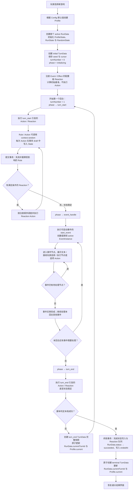

# 游戏主线运行时流程

本文假设游戏脚本（Config、Rule、Action 与 Reaction）已经编写并通过校验，描述玩家从选择“新游戏”到正常通关时的运行时主线。读档、时间线分支、放弃、主动重开和失败终局不在本流程内。

## 关键点

- `initial` 检查点在回合开始前创建；每个正常回合结束后创建 `turn_end` 检查点。两者都保存 Profile、Run、Turn 与 PRNG 的完整状态快照。
- Action 只在事务 draft 中改写 State。每次提交后，引擎重算受影响的 Rule，并持续执行满足条件的 Reaction Action，直到没有新的变化。
- 所有随机判定都由 Rule 或 Action 通过 `context.random()` 执行。PRNG 返回 `[0, 1)` 内的值，其 seed 与 cursor 保存在 RunData 及 TurnData snapshot 中。
- `start_event` 会为事件创建 `EventInstance`；已有同一事件的 active 实例时不会重复创建。事件可以跨回合继续，实例完成后才允许再次创建。
- 成功在本回合的 `turn_end` 阶段判定。终局会创建 `terminal` 检查点并将 RunData 标记为 `succeeded`；该检查点仅用于通关结果与历史记录，不会再进入下一回合。
