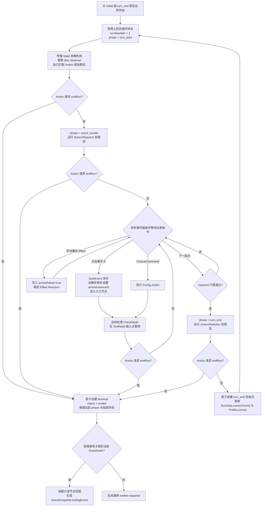

# 游戏运行时流程与 UI 绑定

本文定义 Game 接口、只读快照与运行时状态机。公共协议见 [game.ts](../../src/gameplay/types/game.ts)，存档查询见 [saves.ts](../../src/gameplay/types/saves.ts)。包加载见[外部游戏包与加载](./game-package.md)，玩家流程见[玩家流程与界面设计](./player-flow-and-ui.md)。

## 三类调用边界

| 类型 | 发起方 | 职责 |
| --- | --- | --- |
| Game 方法 | UI | 表达玩家意图，Runtime 按当前 State 重新校验 |
| internal transition | Runtime | 推进 phase、回合、事件与检查点 |
| package Action | Config/Reaction | 通过 ActionContext 改写允许的 State，请求 endRun |

Game 方法不通过 Action registry 查找同名函数。Rule/Action 使用解析 State 视图，不取得 Profile、RunData 或 TurnData 容器。

## Game 接口

```ts
interface Game {
  getSnapshot(): GameSnapshot
  subscribe(listener: () => void): () => void
  startEvent(eventId: string): Promise<CommandResult>
  activateEffect(effectId: string): Promise<CommandResult>
  chooseSingle(eventInstanceId: string, nodeId: string, choiceId: string): Promise<CommandResult>
  setChoiceCount(eventInstanceId: string, nodeId: string, choiceId: string, count: number): Promise<CommandResult>
  executeNodeCommand(eventInstanceId: string, nodeId: string, commandId: string): Promise<CommandResult>
  advanceTurn(): Promise<CommandResult>
  abandon(): Promise<CommandResult>
  close(): void
}
```

Runtime 直接实现 Game。全部状态命令共用互斥和失败协议，busy 时拒绝并发；内部命令标识服务执行与监控，不作为第二套公共 API。失败结果携带 errorId、code、message、revision 与 committed，脚本诊断在内部保留调用链。

一次处理单元将 State、依赖图、observer baseline、PRNG 和终局请求共同稳定，完成校验与 candidate snapshot，再等待必要的持久化；成功后一次性替换状态、图、revision 和 snapshot。任一步骤失败保留提交前状态，观察者与监控异常不能推翻提交。

advanceTurn 先独立提交 turn_end，再启动下一回合；下一回合失败发布已提交边界并返回 committed: true，同一方法可以重试。持久化失败返回 committed: false。其他命令也可能因 endRun 提交 terminal，abandon 提交 abandoned。

## GameSnapshot 与 UI 绑定

GameSnapshot 是已求值、深度只读的普通数据；相同 revision 复用对象引用。包含：

- game/profile 身份、runId、稳定 checkpoint 引用与 kind；
- revision、turnNumber、phase、status；
- characters 及其 attributes，数值保留 number、枚举保留作者标签；
- effects，包含激活状态、绑定角色与 canActivate；
- events.available 与 events.active，active 包含 currentNode；
- canAdvanceTurn 和结构化 advanceTurnBlockers；
- ended/abandoned 的 endedAt；ended 可包含 endingEvent。

status 使用判别联合，abandoned 不包含脚本结局。checkpoint 指向最后稳定记录，当前工作状态可能已进入下一回合。UI 不取得 Config、脚本、Proxy 或 draft。

角色、属性、选项和命令使用有效 visible/unlocked 过滤，事件入口还要求 enabled、无 active 实例且本回合未启动过。active 入口始终可见，currentNode 包含已求值内容与 enabled。Effect 只包含 visible/unlocked/acquired 项，canActivate 结合手动能力、激活状态、enabled 和 event_handle。数组保留 order/id 顺序。

CheckNode 自动运行到 TextNode、实例结束或终局，不进入节点数据。多选 count 来自 TurnState，required 入口/候选链和 active 节点均可阻塞推进。门禁只返回 kind 与 id，UI 生成提示，不重复计算规则。

UI 负责焦点、确认、pending、日期数字格式、动画和导航。usePlay 先设置 pending 再调用具名方法，通过 useSyncExternalStore 直接订阅 GameSnapshot；即使返回 committed: true 的失败，也展示已发布数据。放弃和终局的导航由 UI 分别组织。

close 幂等，禁止新命令、清理监听并丢弃未提交工作，不触发保存。已经发起的持久化单元允许完成原子边界，关闭后不通知 UI，也不再启动下一回合。openGame 的 AbortSignal 在异步边界检查，取消后回收已创建实例。

## 历史检查点

Gameplay.getCheckpoint(source) 共用于预览与结果。加载精确 Config 并校验 Profile 后，按目标 kind 恢复当时的生命周期，通过共享 rules/state-view/snapshot 独立求值；不创建 Runtime、持续 observer 或 Immer 写入事务，不执行 Action、不启动回合、不消耗随机数，也不更新最近访问或恢复游标。

## phase 所有权与状态机

```ts
type TurnPhase =
    | 'initializing'
    | 'turn_start'
    | 'event_handle'
    | 'turn_end';
```

`turnNumber` 与 `phase` 是引擎拥有、UI/Rule/Action 可读的版本化状态。ActionContext 通过只读的 `context.turnState.turnNumber` 与 `context.turnState.phase` 暴露它们，Proxy 会拒绝直接写入。UI 不发送 `SetPhase`；phase 的自动转换也不进入 ActionRegistry。

| 当前 phase | 进入原因 | 允许的 Game 命令 | 离开方式 |
| --- | --- | --- | --- |
| `initializing` | 新游戏或 restart 的 `initial` 恢复边界 | 无 | Reaction baseline 建立后自动开始首回合；失败时关闭本次 Runtime，重新打开仍从 initial 开始 |
| `turn_start` | 首回合或上一回合提交完成 | 无 | 开始阶段稳定后自动进入 `event_handle` |
| `event_handle` | 等待玩家处理零到多个事件或激活 Effect | 事件/节点命令、`activate-effect`、`advance-turn` | 事件交互保持本 phase；下一回合命令进入 `turn_end` |
| `turn_end` | `advance-turn` 已提交检查点 | `advance-turn` 仅用于下一回合启动失败后的重试 | 自动开始下一回合 |

状态机采用 run-to-idle：internal transition、Action、依赖失效传播与匹配的 Reaction Action 持续执行，直到 `event_handle` 用户输入点或 RunData 结束才发布 snapshot。依赖 phase 的脚本是在观察公开生命周期状态，不具备推进状态机的权限。

## 局级初始化顺序

### 新游戏或 restart

1. 要求游戏包已经完成 schema 校验、registry 校验与 linking；局级 runtime 不重复 import JavaScript。
2. 生成 Profile/Run id、时间与 PRNG seed，创建 ProfileState、RunState、TurnState，设置 `turnNumber = 0`、`phase = 'initializing'`。Config 的 `xxxValue` 基础值物化到新 Run 的 RunState。
3. 创建处理单元管理器、PRNG draft、Config/State 合并 Proxy、Rule 依赖图，以及绑定当前 Run 的纯 Rule executor 和事务 Action executor。
4. 物化初始 Effect 等必须保存的回合 `0` 生命周期事实。
5. 校验初始 State，构造包含 `initial` snapshot 的 StoredProfile 并持久化；这是新建存档的稳定成功边界。
6. 打开 Runtime，从 `initial` snapshot 克隆唯一工作状态和依赖图，并按 canonical 顺序为 Effect 生命周期、EffectConfig 与 EventConfig Reaction observer 建立 baseline；新局通常没有 active TextNode。
7. baseline 成功后，以 `initial` 为回滚边界增加 `turnNumber`，进入 `turn_start`，自动运行到 `event_handle`，发布首个可交互 snapshot。baseline 或首回合脚本失败时保留完整 initial 并报告错误。

### 继续、branch 或截断恢复

1. 按 `StoredProfile.configId/configVersion` 取得精确游戏包，并校验稳定存档与所选 snapshot。
2. 克隆 ProfileState、RunState、TurnState 与 RandomState 工作副本，重建处理单元、Proxy、executors、依赖图和 observer baseline。
3. 校验每个 EventState 的 `activeInstanceId` 都指向唯一的 active EventInstance，注册全部配置级 Reaction，并恢复这些 active 实例当前 TextNode 的 Reaction；全部只建立基准。
4. `initial` 与 `turn_end` 从下一回合运行到 `event_handle`；`terminal`/`abandoned` 只产生结果或历史视图。

固定先后关系是：初始生命周期事实先于 `initial` snapshot，持久化 initial 先于 Runtime baseline，executor 先于 baseline，baseline 先于首次 phase 变化。完整 State/Proxy 细节见[运行时系统设计](./runtime-system.md#运行时构造)。

## Reaction 的确定顺序

Reaction 不依赖 Record 插入顺序。引擎按以下 canonical registration key 升序分配 ordinal：

1. EffectConfig：`[0, effect.order, effect.id, reactionListIndex]`；
2. EventConfig：`[1, event.order, event.id, reactionListIndex]`；
3. active TextNode：`[2, event.order, event.id, instance.startedTurn, instance.instanceId, node.order, node.id, reactionListIndex]`。

数字升序，字符串按 Unicode code point 升序。同一写入匹配多个 Reaction 时按 ordinal 入 FIFO；Reaction Action 引发的新匹配追加到队尾。载入、branch 与截断在相同 State 上必须得到相同基准与顺序。

## 单个回合的权威流程


```mermaid
flowchart TD
    A[从 initial 或 turn_end 稳定边界开始] --> B[清理上回合临时状态<br/>turnNumber + 1<br/>phase = turn_start]
    B --> C[传播 State 依赖失效<br/>重算 dirty observer<br/>执行匹配 Action 直到稳定]
    C --> D{Action 请求 endRun?}
    D -- 是 --> Z[原子创建 terminal<br/>status = ended<br/>保留当前 phase 与结局字段]
    D -- 否 --> E[phase = event_handle<br/>运行 Action/Reaction 到稳定]
    E --> E2{Action 请求 endRun?}
    E2 -- 是 --> Z
    E2 -- 否 --> F{发布事件面板并等待玩家操作}
    F -- 点击事件卡 --> G[StartEvent 命令<br/>创建实例并设置 activeInstanceId<br/>进入入口节点]
    F -- Choice/Command --> H[执行 Config Action]
    F -- 手动激活 Effect --> H2[写入 activedValue=true<br/>稳定 Effect Reaction]
    H2 --> F
    F -- 下一回合 --> I{required 门禁通过?}
    I -- 否 --> F
    I -- 是 --> J[phase = turn_end<br/>运行 Action/Reaction 到稳定]
    G --> K[自动处理 CheckNode<br/>在 TextNode 输入点暂停]
    H --> K
    K --> L{Action 请求 endRun?}
    L -- 是 --> Z
    L -- 否 --> F
    J --> M{Action 请求 endRun?}
    M -- 是 --> Z
    M -- 否 --> N[原子创建 turn_end 检查点<br/>更新 RunData.currentTurnId 与 Profile.current]
    N --> B
    Z --> O{调用链有关联的当前 EventNode?}
    O -- 是 --> P[保留只读节点视图<br/>生成 GameSnapshot.endingEvent]
    O -- 否 --> Q[生成通用 ended snapshot]
```

顺序说明：

1. 开始回合时引擎清理不再使用的 TurnState 选择，增加回合数并进入 `turn_start`。
2. phase 变化使 Rule/Reaction 在当前处理单元中稳定；任何 Action 都可先把结局内容写入 `context.runState` 再调用 `context.endRun()`。
3. 未终局时自动进入 `event_handle`，先处理该 phase 变化触发的 Reaction；稳定后再次检查终局，再计算属性、Effect、可启动卡与 active 事件 selector，等待玩家。
4. 玩家可以处理零到多个事件。StartEvent 原子创建实例并设置 EventState 的 `activeInstanceId`；Choice、Command 与 CheckNode Action 用该 id 定位实例并直接写 `currentNodeId` 或结束 `status`，引擎补齐 `nodePath`、Reaction 切换、`endedTurn` 与 active id 清理；每个命令稳定后回到事件面板，phase 保持 `event_handle`。
5. active 且当前节点 `required = true` 的实例阻止 `AdvanceTurn`；尚未点击的普通 enabled 事件不阻塞，但入口 TextNode required 或入口 CheckNode 候选链可达 required TextNode 的 pending 事件同样阻塞。
6. `AdvanceTurn` 进入 `turn_end` 并稳定。存在终局请求时创建 `terminal`；否则创建 `turn_end` 检查点并自动运行下一回合到 `event_handle`。
7. 终局可发生在任何 Action 位置，不要求经过 `turn_end`。`terminal` 保存当时的 phase、State 与 PRNG；引擎不解释结局字段。

## 暂停、放弃与重开

“退出”和从游戏内“选择存档”属于应用命令，不放进 ActionRegistry。退出当前游戏界面时丢弃自回合初始化以来的全部未提交工作状态；再次继续时从进入该回合前的 `initial` 或上一 `turn_end` 检查点重新开始。新建 Run 时保存 `initial`，回合完成、终局和放弃时分别原子保存 `turn_end`、`terminal` 与 `abandoned` 检查点。

“放弃”确认后创建 `abandoned` 检查点并结束整条 active Run，不伪造游戏结局。“再来一局”在 ended 或 abandoned 的只读结果中显示，并创建 restart RunData。完整按钮、存档树与页面跳转见[玩家流程与界面设计](./player-flow-and-ui.md)。
