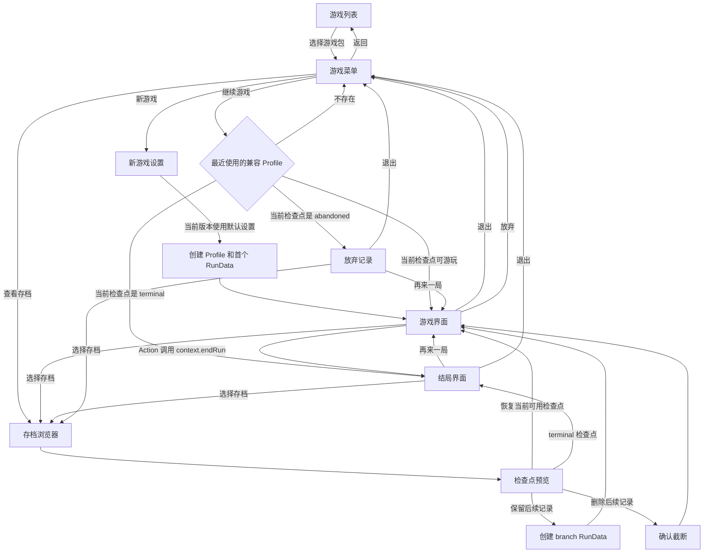

# 玩家流程与界面设计

本文定义玩家从选择游戏包到游玩、查看存档、恢复分支及查看结局的应用层流程，并约定 UI 与引擎之间的交互边界。

本文只描述宿主应用和玩家界面。游戏包加载见[外部游戏包与加载](./game-package.md)，局级初始化与单回合顺序见[游戏运行时流程与 UI 绑定](./gameplay-runtime-flow.md)，游戏内容 API 见[游戏脚本编写指南](./script-authoring.md)，State 与分支语义见[运行时系统设计](./runtime-system.md)，终局和结局字段的关系见[终局与结局](./endings.md)。

## 设计原则

- 一个外部游戏包对应游戏列表中的一个游戏。
- UI 只读取 AppServices 提供的页面 read model，或通过 GameSession 读取不可变 SessionView 并调用宿主命令；UI 不取得游戏包、存档对象、Repository、具体 Runtime，也不直接查找或执行 JavaScript Action 函数。
- `startEvent`、`advanceTurn`、保存、放弃和重开是宿主命令，不依赖游戏脚本中约定的 Action 名。Choice 与 NodeCommand 引用的 Action 仍由统一 Action 执行器执行。
- 游戏脚本在 Action 中先把结局字段写入普通 RunState，再调用 `context.endRun()` 请求终局。UI 只读取 RunData 生命周期是否为 `ended`，不解释结局字段，也不把结局限制为成功或失败。
- UI 按钮对快速重复点击做防抖。命令执行期间禁用会引发重复处理单元的操作，命令和其引发的 Reaction 队列稳定后再统一刷新界面。
- 浏览或预览存档不改变 `Profile.current`；只有明确选择继续、创建分支或截断时才改变恢复游标。
- 应用层的页面选择、展开的存档树、聚焦的事件卡片和确认框等 UI 状态不写入游戏存档。
- 路由页入场动效不得扩大文档的滚动范围或造成瞬时滚动条；长页面继续使用文档滚动，游戏页内部面板维持各自的滚动边界。

## 核心概念

| 概念 | 玩家视角 | UI 职责 |
| --- | --- | --- |
| 游戏包 | 游戏列表中的一个游戏 | 展示元信息、加载状态和可用存档数量 |
| Profile | 一个独立存档槽和长期档案 | 显示名称、更新时间及当前 Run 摘要 |
| RunData | 一局游戏或一条时间线 | 显示 `active`、`ended` 或 `abandoned` 生命周期及其来源 |
| TurnData | 可预览或恢复的检查点 | 显示回合、时间、种类和 pin 状态 |
| branch | 从历史检查点保留原记录后形成的新时间线 | 从来源检查点绘制分支边 |
| restart | 在同一 Profile 中再来一局 | 与时间回溯分支使用不同的边和标签 |
| 结局字段 | 游戏包写入 RunState 的内容状态 | 不参与引擎生命周期判断；结果页优先展示终局调用链关联的 EventNode |

一次“新游戏”创建一个新的 Profile，并在其中创建首个 RunData。“再来一局”在当前 Profile 中创建新的 restart RunData，保留 ProfileState，但重新初始化 RunState、TurnState 和随机状态。

## 页面流程



“新游戏设置”是保留的流程节点。当前版本没有难度实现，点击“新游戏”后使用默认设置直接创建 Profile。未来难度应由游戏包定义，并作为初始化参数保存；引擎不内置简单、普通、困难等固定枚举。

## 页面定义

### 游戏列表

游戏列表展示宿主发现的全部游戏包。每张游戏卡至少包含：

- 游戏名称；
- 背景或简介；
- 游戏包版本；
- 加载状态；
- 兼容存档数量；
- 可选封面。

游戏包无效、入口文件缺失或加载失败时保留错误卡片，禁止进入游戏菜单，并提供明确的错误信息。某个游戏包加载失败不能阻止其他游戏包显示。

游戏卡的元信息来自宿主能够在载入完整脚本前读取的游戏包描述；游戏列表不通过执行游戏 Rule 或 Action 生成。

Catalog 可以同时保留同一游戏 id 的多个精确版本，UI 按 id 合并为一张游戏卡。新游戏使用 catalog 的 `defaultVersions[id]`；继续或查看存档按各 Profile 的 `configVersion` 加载旧版本。最近 Profile 索引按 config id 记录，不能把同一游戏的兼容版本显示成多款游戏。

### 游戏菜单

选择游戏后显示：

| 按钮 | 行为 | 禁用条件 |
| --- | --- | --- |
| 新游戏 | 使用默认设置创建新的 Profile 和首个 RunData | 游戏包加载或校验失败 |
| 继续游戏 | 恢复该游戏最近使用的兼容 `Profile.current` | 没有可继续或可查看结果的 Profile |
| 查看存档 | 打开该游戏的 Profile 列表和分支视图 | 可以始终进入；无存档时展示空状态 |
| 返回游戏列表 | 卸载当前菜单上下文并返回列表 | 无 |

“继续游戏”的目标由应用级存档索引记录的最近使用 Profile 决定。不能只使用 `Profile.updatedAt` 推断目标，因为 pin 或整理存档也可能修改更新时间。最近记录属于便利元数据，读取或写入失败不能推翻已经成功的领域存档操作。

当前检查点可以恢复游玩时进入游戏界面；`terminal` 进入结局界面；`abandoned` 进入只读放弃记录。按钮根据目标显示为“继续游戏”“查看上次结局”或“查看上次记录”。放弃记录只提供“选择存档”“再来一局”和“退出”，不创建 gameplay session。

### 新游戏设置

当前版本使用默认设置，可以在点击“新游戏”后直接开始，不必展示空白设置页。

未来增加难度时应满足：

- 难度选项由游戏包提供；
- 使用稳定 id，不使用展示名称作为逻辑值；
- 选择结果在创建 Profile 或 RunData 时固化，以便存档恢复与调试；
- restart 是否重新选择难度由游戏包配置决定；
- 难度只影响游戏包的初始化输入，不成为引擎硬编码的生命周期分支。

### 存档浏览器

存档浏览器先显示当前游戏包下的 Profile。选择一个 Profile 后显示 RunData 与 TurnData 的时间线树。

Profile 卡建议显示：

- 玩家设置的存档名；没有名称时使用创建时间生成默认显示名；
- 最近游玩时间；
- 当前逻辑回合；
- 当前 Run 生命周期；
- 游戏包版本和兼容状态；
- 当前结局摘要，如有；
- Run 和分支数量。

精确游戏包版本不可用的 Profile 仍显示在列表中，但禁止继续并显示原因；手动删除只操作存档容器，不依赖游戏包，因此仍然可用。结构损坏的 IndexedDB 记录按条隔离并汇总提示；浏览其他有效 Profile 不受单条坏记录影响。

## 存档分支展示

### 树的构造

- 没有 `origin` 的 RunData 是根时间线。
- RunData 内部的 TurnData 按 `turnOrder` 从上到下或从左到右排列。
- `origin.kind = 'branch'` 时，从 `origin.source` 指向新 RunData 的首个检查点。
- `origin.kind = 'restart'` 时使用不同颜色或虚线，并标注“再来一局”。
- `origin.source` 指向已清理检查点时，将 RunData 放入“来源已清理”分组，并保留来源 id 摘要。
- 来源缺失只影响历史连线，不影响目标 RunData 独立预览和恢复。
- `Profile.current` 指向的检查点使用唯一的“当前”标记；预览选中态不能伪装成当前恢复游标。

### 检查点操作

| 检查点状态 | 可用操作 | 行为 |
| --- | --- | --- |
| 当前 Run 的最新可恢复检查点 | 继续 | 恢复当前时间线 |
| 非最新的可恢复检查点 | 创建分支 | 默认强调项；保留原时间线并创建 branch RunData |
| 非最新的可恢复检查点 | 删除后续并继续 | 二次确认后原子截断原时间线 |
| `terminal` 检查点 | 查看结局 | 只恢复结局界面 |
| `abandoned` 检查点 | 查看记录 | 只预览放弃时状态 |
| 任意保留中的检查点 | pin 或 unpin | 控制自动清理策略 |
| 任意检查点 | 预览 | 不修改 `Profile.current` |
| 任意检查点 | 删除检查点 | 二次确认后删除；pin 不提供手动删除保护 |
| 任意 RunData | 删除时间线 | 二次确认后删除该时间线的全部检查点 |
| 任意 Profile | 删除存档 | 二次确认后删除整个存档 |

检查点预览使用同一个按钮展开和收起，并通过 `aria-expanded`、`aria-controls` 关联只读区域。收起正在加载的预览时必须使该请求失效，迟到结果不能重新展开面板；已经成功加载的同一检查点可以在当前页面会话中直接再次展开。切换 Profile 或重新读取存档列表时清除预览选择，这些状态均不写入 Profile 或应用元数据。

已经结束的 RunData 中，`terminal` 之前仍被保留的可恢复检查点可以创建分支或截断；`terminal` 本身不能作为继续起点。

删除后续记录必须显示将删除的 TurnData 数量、受影响的 pin 数量以及不可撤销提示。“创建分支”应作为默认操作。手动删除检查点、时间线或存档同样使用危险操作确认框，显示影响范围和 pin 数量，并明确 pin 不会阻止手动删除。

删除当前检查点时，恢复游标退回同一时间线最后一个剩余检查点，并由该检查点恢复 RunData 生命周期；删除时间线最后一个检查点会同时删除该时间线。删除当前时间线时，恢复游标转到最近更新的剩余时间线；删除最后一条时间线会删除整个 Profile。删除来源检查点或来源时间线不级联删除 branch/restart 后代，后代按来源缺失状态继续独立恢复。

预览历史检查点时，属性、Effect、事件和结局字段均读取该 TurnData 的 snapshot，生命周期按目标检查点的 `initial/turn_end/terminal/abandoned` kind 投影，不能混入当前工作状态。

## 游戏界面

### 桌面布局

```text
┌──────────────────────────┬────────────────────────────────────────────┐
│ 属性面板                 │ 游戏名称 / 回合数 / 当前状态              │
│                          ├────────────────────────────────────────────┤
│ Character A              │ 可启动和进行中的事件卡片                  │
│  属性 1           数值   │ [事件 A] [事件 B] [进行中的事件 C]       │
│  属性 2           枚举   │                                            │
│                          ├────────────────────────────────────────────┤
├──────────────────────────┤ 当前事件节点                               │
│ Effect 面板              │ 叙事内容、单选、多选和 NodeCommand        │
│                          │ 未选择事件时显示引导或本回合摘要           │
│ [已激活] Effect A        │                                            │
│ [未激活] Effect B        ├────────────────────────────────────────────┤
│                          │ 退出  放弃  选择存档                 │
│                          │                              [下一回合]    │
└──────────────────────────┴────────────────────────────────────────────┘
```

左栏宽度建议为桌面可用宽度的 28% 至 35%，右栏占其余空间。属性和 Effect 面板分别滚动，不能因为数量过多将下一回合按钮推出视口。右侧底部操作栏固定在可视区域内。

事件卡片列表和当前事件详情属于同一个事件面板。没有聚焦事件时卡片区域可以占满主体；聚焦事件后仍保留进行中事件和其他可启动事件的入口，并在详情区域处理当前节点。

### 响应式范围

MVP 以桌面为首要目标。窄屏按以下顺序堆叠：

1. 当前事件详情；
2. 事件卡片；
3. 属性；
4. Effect；
5. 固定底部操作栏。

若首版不支持移动端，应定义最小可用宽度，并避免布局静默溢出或遮挡操作按钮。

## 属性展示规则

Character 与 Attribute 使用当前运行时已解析值。

| 条件 | 展示行为 |
| --- | --- |
| Character 或 Attribute 的有效 `visible` 为 `false` | 不展示 |
| 有效 `unlocked` 为 `false` | 不展示 |
| 数值属性 | 展示当前 `value`，可以同时展示 min 和 max |
| 枚举属性 | 展示 `valueDisplay[value]` |
| 有效 `enabled` 为 `false` | 仍展示但使用禁用样式；`enabled` 不是隐藏条件 |
| 多个对象 | 按 Config `order` 升序，id 作为防御性的稳定次序 |

属性值在宿主命令的 Action/Reaction 处理单元稳定后统一刷新。React render 期间不得主动执行 Rule，也不得因重复 render 推进 PRNG。

## Effect 展示规则

| 条件 | 展示行为 |
| --- | --- |
| `visible && unlocked && acquired` | 显示 Effect |
| `actived = true` | 使用“已激活”样式 |
| `actived = false` 且已经获得 | 在“已获得 · 待激活”区域显示 |
| `manuallyActivatable && canActivate` | 在待激活 Effect 卡片显示“激活”按钮 |
| `manuallyActivatable = false` 且 `actived = false` | 显示等待条件提示，不提供手动按钮 |
| 尚未获得 | 默认不展示 |
| active 状态变化 | 在处理单元稳定后刷新，可以播放非阻塞提示 |

Effect 按 Config `order` 排序。绑定 Character 时可以显示所属 Character，但 UI 不依赖 `bindCharacterId` 决定 Effect 是否展示。

## 事件卡片筛选

事件集合在进入 `event_handle` 后显示，并在每个处理单元稳定后重新计算。

| 事件状态 | 是否显示 | 卡片行为 |
| --- | --- | --- |
| 无 active 实例，`visible && unlocked && enabled` | 是 | 点击调用宿主命令 `startEvent(eventId)` |
| 已有 active EventInstance | 始终显示为“进行中” | 点击聚焦现有实例，不调用 `startEvent` |
| 无 active 实例且 `enabled = false` | 否 | 无 |
| 已有 active 实例 | 始终可见且可用 | active 期间不再重新应用事件级 visible、unlocked、enabled |
| 本回合已启动并完成 | 否 | 下一回合若仍 enabled 则重新出现 |
| 引擎正在执行命令 | 显示但禁用 | 防止重复提交 |

事件按 Config `order` 升序，id 作为防御性的稳定次序。`weight` 不参与 UI 排序。事件一旦创建 active EventInstance，其入口在实例结束前保持可见且可用，不会出现处理中途变为不可见或禁用的状态。

可启动事件集合实时响应本回合内的状态变化，不在回合开始时冻结。一个 EventConfig 每个逻辑回合最多启动一次；卡片渲染后若状态发生变化，`startEvent` 仍必须重新校验当前 Run 生命周期、phase、`enabled`、active instance 与本回合启动记录，不能信任旧 UI。

## 事件处理

### UI 与宿主命令

下表的 camelCase 名称是 `GameSession` 为组件提供的 facade。它们只负责维护应用级 busy/导航状态并转换为权威 RuntimeCommand，例如 `startEvent(id)` 调用 `runtime.dispatch({ type: 'start-event', eventId: id })`，`updateSelection(...)` 转换为 `set-multiple-choice`。游戏引擎只有[运行时流程文档](./gameplay-runtime-flow.md#gameplayruntime-接口)定义的 `dispatch` 协议，不存在第二套字符串命令。

| 玩家操作 | UI 调用 | 引擎职责 | 是否执行游戏 Action |
| --- | --- | --- | --- |
| 点击可启动事件卡片 | `startEvent(eventId)` | 校验 phase、unlocked、enabled 与启动记录，创建 EventInstance | 否；这是宿主生命周期命令 |
| 点击进行中事件卡片 | `focusEvent(instanceId)` | 只改变 UI 聚焦状态 | 否 |
| 点击单选 Choice | `chooseSingle(instanceId, nodeId, choiceId)` | 定位配置并通过 Action 执行器执行 Choice Action | 是 |
| 增减多选数量 | `updateSelection(...)` | 校验并写入 TurnState 临时选择 | 否 |
| 点击 NodeCommand | `executeNodeCommand(...)` | 读取完整选择并执行配置 Action | 是 |
| 点击下一回合 | `advanceTurn()` | 校验门禁并驱动回合 phase | 否 |
| 再来一局 | `restartRun()` | 仅在 Run ended 或 abandoned 后创建 restart RunData | 否 |

`startEvent` 不从 Action 注册表中查找名为 `start_event` 的函数。游戏脚本可以自由命名 authored Action，宿主生命周期不会与脚本名称强耦合。

`focusEvent` 是 `GameSession` 的同步 UI 操作，不进入引擎处理单元，也不写入 TurnState；省略实例 id 时清除聚焦。其他命令是否产生 State draft 由其宿主语义决定。

### 节点展示

- TextNode 展示 `content` 和当前有效的 Choice 或 Command。
- Choice 与 Command 分别应用其有效 `visible`、`unlocked` 和 `enabled`。
- CheckNode 不展示；进入后由引擎自动执行检查，直到到达 TextNode、事件结束、Run 进入 `ended` 或发生错误。
- 同一时刻只聚焦一个 EventInstance，但可以存在多个 active EventInstance。
- 离开事件详情不会放弃实例。
- `required` 只控制能否进入下一回合，不禁止玩家查看或处理其他事件。
- Action 在节点处理中调用 `context.endRun()` 后，UI 等待 Action 与 Reaction 队列稳定，再直接进入结局界面。

### 命令执行状态

每次命令执行期间：

- 禁止重复点击同一命令；
- 保留当前界面并显示局部 busy 状态；
- Action、Rule 或 Reaction 失败时回滚当前处理单元并显示错误；
- 队列稳定后一次性更新 UI；
- 每次稳定后检查 RunData 生命周期；
- 生命周期变为 `ended` 时立即进入结局界面，不假定终局只能在 `turn_end` 产生。

## 下一回合

下一回合按钮仅在以下条件全部成立时启用：

| 条件 | 要求 |
| --- | --- |
| Run 生命周期 | 当前 RunData.status 为 `active` |
| phase | 当前为 `event_handle`；上一回合已提交但下一回合启动失败时允许从 `turn_end` 重试 |
| 执行状态 | Action、Reaction 和自动节点队列均为空 |
| required 内容 | 不存在入口或 CheckNode 候选链可达 required 的待处理事件，也不存在当前节点 required 的 active 事件 |
| UI 状态 | 没有阻塞式确认框或存档切换流程 |
| 持久化状态 | 上一次必要提交没有失败 |

尚未点击的普通 enabled 事件不阻止下一回合。若待处理事件的入口 TextNode 为 `required = true`，或其入口 CheckNode 候选链能够到达 required TextNode，该事件会阻止推进；已经启动的事件则按当前 active TextNode 的有效 `required` 判定。CheckNode 自身不承载 required，循环候选链按已访问集合终止检查。

点击后 UI 调用宿主命令 `advanceTurn()`。引擎负责：

1. 重新校验推进门禁；
2. 进入 `turn_end`；
3. 执行由 phase 变化引发的 Reaction 和 Action；
4. Action 链调用 `context.endRun()` 时，等待队列稳定并提交 `terminal` 检查点，将 RunData 生命周期改为 `ended`；
5. Run 仍为 `active` 时创建 `turn_end` 检查点；
6. 进入下一回合的 `turn_start`；
7. 等待自动执行稳定；
8. 若期间没有进入 `ended`，则进入 `event_handle` 并返回新的 UI 视图。

UI 不直接写入 phase，也不通过某个脚本 Action 模拟阶段切换。若步骤 5 的检查点已成功保存、而步骤 6 或 7 失败，Session 刷新到已提交的 `turn_end`，错误结果标记 `committed: true`；玩家再次点击同一按钮即可重试下一回合。保存检查点本身失败时 `committed: false`，界面保留命令前状态。

## 底部按钮语义

| 按钮 | active Run 中的行为 | ended Run 中的行为 | 确认 |
| --- | --- | --- | --- |
| 退出 | 丢弃本回合初始化以来的全部未提交状态并返回游戏菜单 | 返回菜单 | active Run 需提示本回合进度不会保留 |
| 放弃 | 放弃整条当前 Run，创建 `abandoned` 检查点 | 隐藏或禁用 | 必须二次确认 |
| 选择存档 | 丢弃本回合未提交状态，再打开当前游戏的存档浏览器 | 直接打开存档浏览器 | active Run 需确认本回合进度不会保留 |
| 再来一局 | 隐藏或禁用 | 创建 restart RunData | 无 |
| 下一回合 | 调用 `advanceTurn()` | 隐藏或禁用 | 门禁不满足时说明原因 |

`abandoned` 记录不显示“放弃”或“下一回合”；它允许选择存档、创建 restart RunData 或退出到游戏菜单。

### 退出与切换存档

游戏状态只在 `turn_end` 持久化。玩家从 active Run 退出游戏界面或打开存档浏览器时，宿主丢弃本回合初始化以来产生的 ProfileState、RunState、TurnState 与 RandomState 工作副本，不创建检查点，也不更新恢复游标。再次继续时，从进入该回合前的 `initial` 或上一 `turn_end` 检查点重新初始化该回合。

### 放弃与重开

“放弃”表示放弃整条当前 Run，而不是只丢弃自上个检查点后的变化。宿主创建 `abandoned` 检查点，将生命周期改为 `abandoned` 并记录 `endedAt`。放弃属于宿主生命周期，不要求游戏脚本写入结局字段，也不能伪造一种游戏内容结局。

“再来一局”在 Run 进入 `ended` 或 `abandoned` 后显示。宿主以对应的 terminal 或 abandoned 检查点作为历史来源创建 restart RunData；restart 只保留恢复游标当前的 ProfileState，不复制上一局的 RunState、TurnState 或结局字段。

## 任意结局展示

游戏 Action 可以在任意合法执行点先写入游戏包定义的结局字段，再调用无参数的 `context.endRun()`。UI 只依赖 `RunData.status === 'ended'` 或等价的会话生命周期投影决定是否进入结局界面。

UI 不得：

- 将结局限制为成功或失败；
- 根据某个固定结局字段或固定字符串判断 Run 是否结束；
- 假定终局只在下一回合或 `turn_end` 检查；
- 为未知结局自动赋予成功或失败样式；
- 在 restart 时根据字段名称猜测需要清理的内容状态。

游戏包通常先进入一个展示结局叙事的 EventNode，再由其中 Command 或 Choice 的 Action 调用 `context.endRun()`。这种情况下，调用完成后 UI 将调用链关联的当前节点作为只读 `endingEvent` 保留，并提供：

- 游戏名称；
- 结局 EventNode 的标题与内容；
- 当前逻辑回合和结束时间；
- “选择存档”；
- “再来一局”；
- “退出”。

引擎不额外调用结局展示适配器，也不根据 RunState 字段生成结局文案。配置级 Reaction、节点 Reaction 或阶段变化引发的 Action 也可以请求终局；调用链没有关联当前 EventNode 时 `endingEvent` 省略，结果页显示游戏名称、当前逻辑回合、结束时间和通用终局状态。terminal snapshot 仍完整保留普通 RunState 结局字段，供历史检查和未来的包级展示扩展使用。

## UI 与数据边界

UI 通过宿主应用服务获取数据：

| 服务 | 职责 |
| --- | --- |
| AppServices 查询 | 组合游戏包与存档数据，返回 GameListItem、GameMenuView、SaveBrowserView、ResultView 等页面专用 read model |
| AppServices 命令 | 创建新存档、执行 SaveCommand、restart 或打开 GameSession；隐藏 Repository 和具体实现 |
| GameSession | 执行游玩与应用命令，维护 busy、focus、导航并暴露 SessionView |
| SessionView | 向游玩 UI 提供不可变、已解析的属性、Effect、事件、节点、门禁、生命周期和可选结果路由 |

React 组件不得持有 StoredProfile、RunData、LoadedGamePackage、Repository、具体 GameplayRuntime 或运行时 Proxy，不得在 render 中执行 Rule，也不得直接调用 Action 的 `exec`。React StrictMode 下的重复 render 不得产生引擎写入、Action 调用或 PRNG 推进。

`GameSession`、`SessionView` 与 `SaveCommand` 公共类型定义在 [runtime.ts](../../src/types/runtime.ts)，页面 read model 定义在应用服务边界。分支、截断、pin 和分层手动删除通过 AppServices 的命令方法执行，组件不创建 controller，也不直接读取或改写 StoredProfile。

SessionView 至少应提供：

- 当前游戏包和 Profile 标识；
- Run 生命周期；
- 当前回合与 phase；
- 已过滤、排序的属性和 Effect；
- 可启动事件卡片和 active EventInstance；
- 当前聚焦节点；
- `canAdvanceTurn` 及不可推进原因；
- 命令 busy 状态；
- ended 时保留的结局 EventNode 只读视图。

结果页不打开可写 GameplayRuntime。AppServices 从指定 terminal/abandoned snapshot 构造一次性只读投影，不启动回合状态机、不写存档，也不更新恢复游标。

## 加载、错误与空状态

宿主应用必须定义以下状态：

- 没有游戏包；
- 游戏包加载中；
- 游戏包校验失败；
- 没有存档；
- 存档版本不兼容；
- 存档损坏；
- Action 或 Rule 抛出异常；
- Reaction 循环或超过执行上限；
- 保存空间不足或原子提交失败；
- 分支来源检查点已经清理；
- 终局没有关联可展示 EventNode，使用通用结果视图；

运行时命令失败时保留最后一个稳定状态，不跳转到错误页面。存档原文件或原记录必须保留。错误提示包含游戏包 id、Profile id 和可定位的字段路径，但面向玩家的默认界面不展示完整脚本堆栈。

## 可访问性

- 所有卡片操作使用真实 `button` 或等价的可聚焦控件；
- busy、disabled、required 和 active 状态不能只靠颜色表达；
- 打开确认框后将焦点移入，关闭后恢复到触发按钮；
- 新事件出现、Run 进入 `ended` 和下一回合被阻止时提供非侵入式状态提示；
- 事件节点更新后将焦点移动到节点标题，而不是页面顶部；
- 禁用按钮同时提供可读的禁用原因。

## 开发前待确认事项与建议

下表中的建议作为 MVP 默认方案；如果后续决定不同，应先同步修改本文及对应运行时文档再实现。

| 事项 | 当前需要明确的边界 | 建议 | 结论 |
| --- | --- | --- |
| 游戏包发现方式 | 浏览器不能扫描任意本地目录 | MVP 使用显式 catalog/manifest；本地目录导入另行设计 | 同意 |
| 存档后端 | Profile 快照可能较大 | 浏览器 MVP 使用 IndexedDB，不使用 localStorage 保存完整存档 | 同意 |
| Profile 含义 | 多个新游戏如何分组 | 一次“新游戏”创建一个 Profile | 同意 |
| 最近继续目标 | 同一游戏可以有多个 Profile | 应用索引保存每个 Config 的最近使用 Profile id | 同意 |
| 存档显示名 | Profile 只有 id 和时间 | 增加应用层可选 label，缺省使用创建时间 | 同意 |
| 回合中保存 | 游戏状态的持久化边界 | 只在 `turn_end` 保存；退出时丢弃本回合全部状态 | 已确认 |
| 选择存档前的当前进度 | 本回合尚未到达持久化边界 | 丢弃本回合状态后进入存档浏览器 | 已确认 |
| active 事件后来不可见或禁用 | active 实例的入口规则 | active EventInstance 在结束前始终可见且可用 | 已确认 |
| 事件列表刷新时机 | “每回合”可能被理解为冻结集合 | 每个稳定事务后实时刷新 | 同意 |
| 玩家启动事件 | 旧设计可能依赖 `start_event` Action 名 | 统一使用宿主 `startEvent`，不设置魔法 Action 名 | 同意 |
| 多个 active 事件 | 焦点和下一回合门禁 | 允许多个实例，只聚焦一个；required 只阻止下一回合 | 同意 |
| 任意结局展示 | 结局内容与 `endRun()` 的触发位置 | 优先由 EventNode 展示；其他 Action 也可终局，此时使用通用结果视图 | 已确认 |
| 终局检查时机 | `context.endRun()` 可以在任意 phase 调用 | 每条 Action 和 Reaction 队列稳定后检查生命周期 | 同意 |
| 难度 | 没有配置与持久化模型 | MVP 使用默认值；以后由游戏包定义初始化参数 | 同意 |
| active Run 再来一局 | 按钮出现时机 | active 时隐藏；ended 或 abandoned 记录允许创建 restart RunData | 已确认 |
| 移动端 | 目标布局是桌面两栏 | MVP 桌面优先，窄屏保证基本堆叠 | 同意 |
| 命令并发 | 快速点击可能重复提交 | 前端按钮防抖，命令执行期间禁用重复操作 | 已确认 |
| 不兼容存档 | 列表是否隐藏 | 保留显示、禁用载入并提供版本错误 | 同意 |
| 内容版本变化 | 项目仍在开发且旧内容可以舍弃 | 只加载 exact version；不迁移旧存档，结构不兼容时直接清理 | 已确认 |
| 分支来源被清理 | 时间线无法连接来源节点 | 显示为来源缺失的独立 Run，不阻止恢复 | 同意 |
| 保存或脚本失败 | UI 是否仍然离开当前页面 | 保留最后稳定状态，只有持久化成功才导航 | 同意 |

## 建议的 MVP 实施顺序

1. 确定游戏包 manifest、PackageCatalog、SaveRepository 和 GameSession 接口。
2. 实现仅在 `turn_end` 提交的存档边界及应用级最近 Profile 索引。
3. 使用 mock SessionView 实现游戏列表、游戏菜单、存档空状态和桌面游戏布局。
4. 接入 `startEvent`、节点操作与 `advanceTurn`。
5. 实现存档树、创建 branch、截断、pin 和来源缺失降级。
6. 接入 `context.endRun()` 后的 ended 生命周期跳转和结局展示。
7. 补齐脚本错误、保存失败、键盘操作和窄屏布局。

## 与其他文档的边界

- 游戏包目录、外部 JSON 和 JavaScript 的加载顺序由游戏包加载文档定义。
- 宿主命令、Action 执行器、phase 推进和单回合代码顺序由运行时流程文档定义。
- `turn_end` 的恢复、分支、清理和持久化约束由运行时系统文档与类型声明定义。
- 结局字段的具体结构由各游戏包决定；引擎只提供 `context.endRun()` 和 `ended` 生命周期。
- 本文负责页面导航、玩家可见状态、布局、筛选规则、按钮语义和 UI 与宿主之间的调用边界。
