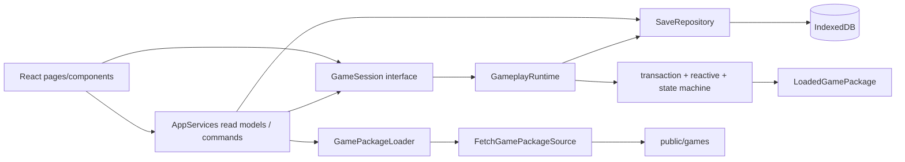

# Maker Simulator MVP 技术规格

> 状态：可用于开始开发  
> 目标平台：现代桌面浏览器，兼顾窄屏基本可用性  
> 技术基线：React 19、TypeScript 6、Vite 8、纯前端 SPA

## 1. 目标与范围

本规格把现有游戏设计转换成可实施的软件结构。首个 MVP 必须完成以下闭环：

1. 从 `public/games` 发现并加载游戏包；
2. 创建 Profile 和首个 RunData；
3. 执行 Rule、Action、Reaction、事件节点和回合状态机；
4. 在 IndexedDB 中原子保存回合检查点；
5. 退出后继续、查看存档、创建分支、截断、pin 和分层手动删除；
6. 处理放弃、终局、通用结果页和 restart；
7. 使用符合 `DESIGN.md` 的 React UI 完成玩家流程。

本轮：不设计内容迁移模块、难度参数、通用媒体字段、稳定的外部 SaveRepository API 或完整调试工具协议。实现内部可以建立满足 MVP 的最小服务，但不把它们承诺为游戏包公共 API。

自动化测试代码暂不在范围内。开发期间仍必须通过 TypeScript 构建和 ESLint；功能验收按本文末尾的人工验收清单执行。

## 2. 规范优先级

发生描述差异时按以下顺序处理：

1. `src/types`：跨模块公共数据结构和命令协议；
2. `docs/game-design`：运行时、存档、终局和玩家流程语义；
3. 本文：代码组织、技术选型和交付顺序；
4. `DESIGN.md`：视觉 token、组件造型、排版和响应式表现。

`DESIGN.md` 是视觉参考，不改变游戏运行时语义。其 Figma 专有字体使用默认无衬线字体

## 3. 技术栈与预装依赖

仓库已有 `pnpm-lock.yaml`，后续依赖统一使用 pnpm 管理。开始开发前执行：

```bash
pnpm add react-router zod idb immer @headlessui/react
```

| 依赖 | 用途 | 使用边界 |
| --- | --- | --- |
| `react-router` | SPA 页面路由和浏览器前进/后退 | 使用 Declarative Mode；不采用 React Router Framework/Data Mode |
| `zod` | 校验 catalog、manifest、Config、module export 和存档 JSON | 外部输入先以 `unknown` 接收，解析成功后才转成领域类型 |
| `idb` | Promise 化并类型化 IndexedDB | 所有持久化仍通过项目自己的 repository 封装 |
| `immer` | 处理单元中的 copy-on-write draft、提交和回滚 | 不把 Immer Draft 或 Patch 暴露给脚本、UI 或存档 |
| `@headlessui/react` | Dialog、Menu、Listbox、RadioGroup、Disclosure 等无样式可访问组件 | 只使用行为与无障碍能力，视觉全部由项目 CSS 控制 |

依赖依据：[React Router Declarative 安装](https://reactrouter.com/start/declarative/installation)、[Zod 安装](https://zod.dev/)、[idb 文档](https://github.com/jakearchibald/idb)、[Immer 安装](https://immerjs.github.io/immer/installation/)、[Headless UI React](https://headlessui.com/react/dialog)、[Inter Fontsource](https://fontsource.org/fonts/inter/install)、[JetBrains Mono Fontsource](https://fontsource.org/fonts/jetbrains-mono/install)。

MVP 不引入以下依赖：

- 不使用 Redux、Zustand 等状态库；运行时和 Session 已经是 external store，React 使用 `useSyncExternalStore` 订阅。
- 不使用 Tailwind、CSS-in-JS 或带视觉主题的 UI 组件库；使用原生 CSS、CSS Modules 和 Headless UI。
- 不使用日期、UUID、随机数或图标库；分别使用 `Date`、`crypto.randomUUID()`、项目内确定性 PRNG 和现有 SVG sprite。
- 不引入动画库；过渡使用 CSS，并尊重 `prefers-reduced-motion`。

同时把 `tsconfig.app.json` 开启 `strict: true`。所有新代码禁止用 `any` 穿透边界；外部数据使用 `unknown` 加 schema 解析。

## 4. 总体架构



分层约束：

- UI 只依赖页面 read model、`GameSession` 接口与 `SessionView`；不取得游戏包、存档领域对象、Repository、具体 Runtime 或 Runtime Proxy。
- AppServices 组合查询和应用命令，对页面隐藏 PackageLoader、Repository、controller 和具体 Runtime。
- Session 负责 busy、focus、导航、确认和服务编排；不实现 Rule/Action 语义。
- GameplayRuntime 只接收完成 linking 的 `LoadedGamePackage` 和工作 State。
- 引擎核心不依赖 React、DOM、IndexedDB 或 fetch。
- package loader 不创建 Profile；SaveRepository 不执行游戏脚本。
- 领域层不得从 `src/ui`、`src/app` 反向导入。

## 5. 建议目录结构

```text
public/
  games/
    catalog.json
    example-game/
      1.0.0/
        manifest.json
        config.json
        rules.js
        actions.js
        assets/

src/
  app/
    AppRouter.tsx
    AppServices.tsx
    routes.ts
  package-loader/
    schemas/
    FetchGamePackageSource.ts
    GamePackageLoader.ts
    linker.ts
    module-loader.ts
    errors.ts
  persistence/
    database.ts
    SaveRepository.ts
    AppMetadataRepository.ts
  runtime/
    GameplayRuntimeImpl.ts
    errors.ts
    monitor.ts
    profile-factory.ts
    random.ts
    reactivity.ts
    reactions.ts
    selectors.ts
    state-view.ts
  session/
    GameSessionImpl.ts
    SaveBrowserControllerImpl.ts
    session-store.ts
  ui/
    pages/
    layouts/
    components/
    hooks/
    styles/
      tokens.css
      global.css
      utilities.css
  types/
    index.ts
    model.ts
    package.ts
    runtime.ts
```

单个文件只承担一个主要职责。跨模块只从该模块的 `index.ts` 导出稳定入口，禁止 UI 深层导入引擎内部文件。

## 6. 游戏包交付与 fetch 协议

### 6.1 固定位置

catalog 固定为相对 Vite base 的 `games/catalog.json`。实现不得写死站点根路径 `/games/catalog.json`，应使用 `import.meta.env.BASE_URL` 构造 URL，使子路径部署仍然可用。

最小 catalog：

```json
{
  "schemaVersion": 1,
  "games": [
    {
      "id": "example-game",
      "version": "1.0.0",
      "name": "Example Game",
      "background": "用于开发和人工验收的示例游戏",
      "manifest": "./example-game/1.0.0/manifest.json",
      "cover": "./example-game/1.0.0/assets/cover.webp"
    }
  ],
  "defaultVersions": {
    "example-game": "1.0.0"
  }
}
```

`public/games/example-game/1.0.0` 必须随第一阶段开发一并建立。它不是自动化测试 fixture，而是贯穿人工验收的最小可玩包。

### 6.2 FetchGamePackageSource

`FetchGamePackageSource` 实现现有 `GamePackageSource`：

- `list()`：fetch catalog，检查 HTTP 状态后以 Zod 解析；
- `readJson(location)`：fetch 文本，先捕获 JSON 语法错误，再返回 `unknown`；调用方负责具体 schema；
- `resolve(base, reference)`：使用 `new URL(reference, base)`，拒绝非 `http:`、`https:` 或本地开发允许的同源协议；
- catalog、manifest、config 和资源通过 fetch 获取；
- 开发环境使用 `cache: 'no-cache'`，生产环境使用浏览器默认缓存；已成功加载的 `(id, version)` 在内存中复用。

所有错误转换成 `PackageLoadError`，保留 errorId、stage、包 id/version、`resourceLocation`、`jsonPointer` 和原始 cause。HTTP 非 2xx、JSON 语法错误、schema 错误和 linking 错误必须可区分；Zod issue 的路径转换为 JSON Pointer，registry/linker 错误在加载边界补齐包身份。

### 6.3 JavaScript module 加载

`fetch()` 只能取得 module 文本，不能直接得到函数。为了满足游戏包资源由 fetch 获取的前提，`module-loader.ts` 采用以下流程：

1. fetch `rules.js` 或 `actions.js` 文本；
2. 检查响应状态与 JavaScript MIME；
3. 用 `Blob([source], { type: 'text/javascript' })` 创建临时 module URL；
4. 使用 `import(/* @vite-ignore */ blobUrl)` 执行可信模块；
5. 校验导出的 `rules` 或 `actions`；
6. import settle 后立即 `URL.revokeObjectURL(blobUrl)`。

MVP 的 `rules.js` 与 `actions.js` 必须是自包含的单文件 ESM，不允许相对 import。原因是 blob module 没有原文件目录可用于解析相对依赖。游戏包需要拆分源码时，应在发布前 bundle 成这两个入口文件。

这些脚本与设计文档一致，被视为完全可信，并以应用权限执行。部署 CSP 必须允许同源 fetch 和 `blob:` module；若宿主策略禁止 `blob:`，改用同源原生动态 import，但该变化应在部署配置中明确记录。

### 6.4 加载与 linking

加载器严格执行：catalog → manifest → config/module 并行读取 → schema 校验 → registry 校验 → linking → deep freeze → `LoadedGamePackage`。

linking 至少检查：

- descriptor、manifest、Config meta 的 id/version/name 一致；
- Record key 与对象 id 一致，id 字符合法且排除原型污染名称；
- entryNode、candidateNodes、bindCharacterId 等静态引用存在；
- `xxxValue`/Rule、Reaction、Choice、Command、Check 引用的 Rule/Action key 已注册；
- `ValueRef.path` 非空，静态路径能够定位 Primitive 字段；
- number/enum/maxCount/weight/order 满足领域约束；
- registry object key、implementation.key 和函数形状一致。

失败的包保留 catalog descriptor 和错误信息供游戏列表显示，但不能创建游戏或进入 Runtime。

## 7. Schema 与类型策略

`src/types` 继续作为公共 TypeScript 声明。Zod schema 与领域类型必须保持一一对应，但外部数据的真实来源是 schema 解析结果。

实现规则：

- schema 文件按 catalog、manifest、config、save 拆分；
- 共享 id、Primitive、CommonConfig schema，避免每个对象重复约束；
- schema 使用 `.strict()` 拒绝未知字段；
- `z.infer` 只用于 schema 内部辅助，不替换公共类型名称；
- 用 `satisfies z.ZodType<PublicType>` 或等价编译约束防止 schema 漂移；
- 业务引用、唯一 order、路径可达性属于 linking，不塞入基础结构 schema；
- 错误路径统一格式为 JSON Pointer，例如 `/events/dark-night/nodes/entry/choices/run`。

存档加载也必须先验证结构和领域约束，再构造 Runtime。不得把 IndexedDB 中的值直接断言成 `StoredProfile`。

## 8. IndexedDB 持久化

### 8.1 数据库结构

数据库名：`maker-simulator`，当前 database version：`3`。

| Object store | key | index | 内容 |
| --- | --- | --- | --- |
| `profiles` | `profileId` | `by-config-id`、`by-updated-at` | `StoredProfile` 稳定检查点历史与恢复游标 |
| `app-metadata` | `key` | 无 | 最近 Profile、UI 级持久化元数据 |

`app-metadata` 至少支持 `recent-profile:<configId> -> profileId`。页面展开、事件 focus、确认框和存档预览选中项不持久化。

每次稳定保存直接写入完整 StoredProfile record。这样可以让 RunData、TurnData、恢复游标、pin 和 `storageRevision` 位于同一个 IndexedDB transaction 中；Runtime 的未提交工作 State 不进入该 record。增量快照和拆表优化不在本轮范围。

项目处于开发阶段，不维护旧存档结构迁移。数据库结构升级时清空旧 `profiles` 与 `app-metadata` 记录，再按当前 schema 创建新数据。

### 8.2 Repository 最小能力

内部 `SaveRepository` 提供：

```ts
interface SaveRepository {
    listByConfigId(configId: string): Promise<{
        profiles: readonly StoredProfile[];
        invalid: readonly InvalidSaveRecord[];
    }>;
    get(profileId: string): Promise<StoredProfile | undefined>;
    put(profile: StoredProfile): Promise<StoredProfile>;
    delete(profileId: string, expectedStorageRevision: number): Promise<void>;
}
```

`put` 必须在同一个读写事务中读取现有记录、比较 `storageRevision`、写入递增后的对象并等待 `tx.done`，之后才返回已保存对象。`delete` 在删除整个 Profile 前执行相同的 revision 比较。版本不匹配时抛出冲突，不能覆盖或误删另一个页面的新记录。运行时 draft、Proxy、LoadedGamePackage 和函数不得传入 repository。写入前以 `structuredClone` 产生纯数据副本并执行结构校验；精确 Config 领域校验在应用层或 Runtime 进入 Repository 前完成。列表查询逐条隔离坏记录，不能因单条损坏数据阻断其它存档。

`validateStoredProfile(unknown)` 负责 schema、游标、检查点集合和 RunData 生命周期等不依赖游戏内容的约束。`validateProfileAgainstConfig(profile, config)` 负责 Config 身份、全部 State key/id、EventInstance、选择、Effect 绑定、终局引用、回合单调性和 State 层级约束。存档列表可以只执行第一层；标记可继续状态以及任何继续、分支、截断、restart、Runtime 打开或候选检查点写入前必须加载精确包并执行第二层。手动删除只收缩容器并在写回前执行第一层，因此精确游戏包不可用时仍可清理。领域错误携带 JSON Pointer，原始记录保持不变。

不得在已开启的 IndexedDB transaction 中等待 fetch、脚本执行或 UI Promise。先在内存中完成整个候选 StoredProfile，再开启短事务完成 revision 比较和一次写入。

### 8.3 保存边界

- 新游戏：构造并校验带 `initial` 的 StoredProfile 后首次保存，再打开 Runtime 建立 baseline；
- 普通事件/Choice/Command：只更新内存工作状态，不写 IndexedDB；
- `advance-turn`：`turn_end` 稳定后创建检查点并保存，成功后才开始下一回合；
- `endRun()`：队列稳定后创建 terminal 并立即保存；
- 放弃：创建 abandoned 并立即保存；
- pin、branch、truncate、restart：新 Profile 副本完整校验后原子保存；
- 手动删除 TurnData/RunData：忽略 pin，在副本上修复游标后结构校验并原子保存；删到空 Profile 时使用 revision-aware delete；
- 退出或打开存档：丢弃当前未提交工作状态，不保存。

保存失败时保留数据库原记录和最近稳定 UI snapshot，不进行页面跳转。

## 9. 运行时核心

### 9.1 工作对象

每个 GameplayRuntime 实例持有：

- 一个只读 `LoadedGamePackage`；
- 当前 StoredProfile 的内存副本；
- 从当前检查点克隆的唯一 StateSnapshot 工作状态；
- Config/ProfileState/RunState/TurnState 合并视图；
- Rule/Action executor；
- 可事务复制的 Rule 依赖图、计算缓存和 Effect 生命周期 observer；
- 当前 Reaction 注册表、baseline 和 FIFO；
- 当前不可变 RuntimeSnapshot 与 revision；
- 串行 command queue；
- 当前 Run 独立的 RuntimeMonitor。

Runtime 不持有 React state。`subscribe/getSnapshot` 实现标准 external store：相同 revision 返回同一个 snapshot 对象，每个稳定处理单元最多通知一次。

### 9.2 合并 State 视图

读取优先级固定为 TurnState → RunState → ProfileState → Config。运行时视图必须：

- 保持与 Config 相同的 Record 路径；
- 新 Run 将 `xxxValue` 基础值物化到 RunState，并允许对应 State 层覆盖；
- `xxx` 始终返回 Rule 计算值，并拒绝对派生字段本身写入；
- 不把 Config 静态字段复制进稀疏 State；
- 创建某个稀疏 State 项时自动写入正确 id；
- 拒绝 Config 中不存在的静态对象 key；
- 只对 NumberAttribute 的 value 执行 min/max clamp；对 enum 非法下标以及 weight/maxCount 等其他越界数值报错；
- 只允许 Action 类型声明中开放的字段写入。

Rule Proxy、Action Proxy 和 UI selector 共用路径解析器，但权限不同。Proxy 的 `get`、`ownKeys` 与集合成员读取向当前计算节点报告 State 路径；Action 和引擎内部写入向依赖图报告实际变更路径。不要维护三份独立的合并逻辑。

### 9.3 处理单元与 Immer

处理单元开始时，用 Immer 为以下组合对象创建一个共享 draft：

```ts
interface TransactionRoot {
    profile: StoredProfile;
    working: StateSnapshot;
}
```

Action Proxy 把不同 context scope 的写入路由到 `working` 中对应的 State draft。嵌套 Action、Reaction Action、EventInstance 派生写入、PRNG，以及检查点提交时的 Profile/RunData 元数据使用同一个根 draft。

提交顺序：克隆稳定依赖图 → 执行 root 操作 → 验证 Action frame → 生成事件派生写入 → 沿反向依赖边失效计算节点 → 重算 dirty Effect/Reaction observer → 调度 Reaction → 队列稳定 → 处理可选终局/检查点 → `finishDraft` → 验证并生成候选 RuntimeSnapshot → 必要时持久化候选 StoredProfile → 一次性替换 Runtime 状态、依赖图、baseline、revision 与 snapshot → 通知订阅者。

发布前任一步骤抛错时丢弃候选结果。持久化完成后的监控与订阅通知必须吞掉观察者自身异常，不能把已经提交的事务报告成回滚；不得尝试手工反向应用部分写入。

实现内部设置防失控常量：单处理单元最多 512 个 Action frame、4096 次 Rule 重算、128 次自动 CheckNode 跳转。超过限制统一返回 `script-error`；这些值是开发期防护参数，不是游戏包 API。

### 9.4 Rule 与依赖图

Rule executor：

- 构造只读 RuleContext；
- 以 `[ruleKey, args]` 标识一次调用，args 用稳定 Primitive 序列编码；
- 执行期间记录 State Proxy 路径和嵌套 Rule 计算节点；
- 成功重算后用本次读取集合替换旧依赖，支持条件分支；
- 检测同步递归调用栈中的循环；
- 验证 `xxxValue`/Rule 字段和 Reaction watch 所需的返回类型；
- 缓存未失效的基础类型结果；对象结果只保留依赖，避免缓存绑定旧 Immer draft 的 Proxy；
- 不缓存异常结果或失败计算收集到的动态依赖；
- 统计处理单元内的 Rule 重算次数、耗时、依赖数量和反向扇出。

依赖图同时维护 `State path -> computation nodes`、`computation node -> State/rule dependencies` 和反向计算边。State 写入使受影响节点及其反向可达节点 dirty；没有持续 observer 的节点在下次读取时惰性重算。Config 只读且一局内不变，对 Config 的读取不登记依赖。Rule 不获得 random、action、endRun、容器元数据或真实时间。

### 9.5 Reaction

EffectConfig 与 EventConfig Reaction 在 Runtime 构造时注册一次；TextNode Reaction 随 EventInstance 节点生命周期精确注册和注销。注册时构造持续 watch observer，只计算 baseline，不执行 Action。State 写入后只重算 dirty observer，使用 `Object.is` 比较前后 Primitive，再应用 from/to。已入队但执行前已经离开作用域的 Reaction 跳过。

dirty Reaction 按已定义 canonical ordinal 排序后进入 FIFO；Reaction Action 引发的新匹配追加队尾。首次 `endRun()` 只记录 pending 请求和可选来源 EventInstance，队列仍运行到稳定；后续请求不替换首次来源。依赖图、observer 和 baseline 与 State draft 同属处理单元候选状态，失败时一起丢弃。

### 9.6 确定性随机数

MVP 使用项目内固定算法 `xmur3-mulberry32`：

1. `xmur3(seed)` 生成 32 位基础种子；
2. 第 `cursor` 次调用以 `baseSeed + cursor` 作为 mulberry32 输入，只取第一个 `[0, 1)` 输出；
3. 在 transaction draft 中令 cursor 加一；
4. 失败时 cursor 随 draft 回滚。

算法由当前引擎实现固定，不写入游戏包。开发阶段更换算法时直接使旧存档失效并清理，不维护随机算法迁移分支。游戏脚本不得使用 `Math.random()`。

### 9.7 EventInstance

`start-event` 由引擎创建实例、入口路径和 active id。Action 只通过 ActionRunRuntime 修改 active instance 的 `currentNodeId` 或终止 `status`。

每个 Action frame 结束时比较字段写入：

- 最多一次跳转或一次终止；
- 跳转目标属于当前 Event；CheckNode 目标还必须属于 candidateNodes；
- 合法跳转追加 nodePath、注销旧 Reaction、清理旧选择、注册新节点 baseline；
- 进入 CheckNode 后把 check Action 放入 FIFO，直到 TextNode、终态、终局或错误；
- 终止实例时写 endedTurn、清 active id、清选择并注销节点 Reaction。

### 9.8 回合状态机

状态机按 run-to-idle 实现：

```text
initializing
  -> initial 已持久化
  -> turnNumber + 1
  -> turn_start（处理到稳定）
  -> event_handle（发布输入 snapshot）
  -> advance-turn
  -> turn_end（处理到稳定）
  -> turn_end checkpoint 持久化
  -> 下一 turn_start
```

任何阶段稳定前出现 pending endRun 都改为 terminal 提交并停止推进。UI 命令只在 `event_handle` 接受，除非其定义明确属于 Session 应用命令。

`advance-turn` 是两个处理单元：先提交本回合，再从该检查点启动下一回合。第二个处理单元失败时，第一个检查点仍有效。

### 9.9 Snapshot selectors

selector 从稳定运行时视图生成 `RuntimeSnapshot`：

- Attribute：应用 Character/Attribute visible、unlocked，携带 Character 展示名；
- Effect：应用 visible、unlocked、acquired；
- EventCard：只包含当前可启动事件；
- ActiveEvent：始终包含 active 实例及当前 TextNode read model；
- Choice/Command：过滤 visible、unlocked，投影 enabled；
- canAdvanceTurn：Runtime 只根据 run status、phase、执行队列和 required blocker 计算 gameplay 门禁；UI 再与 Session busy、确认框和持久化状态组合决定按钮是否可用；
- ended：根据 terminal 的 `endingEventInstanceId` 可选重建 EndingEventView。

数组在 selector 中按 order、id 排序。UI 不再执行过滤规则或访问 Config 补字段。

### 9.10 单局运行监控

MVP 提供一个仅输出到浏览器开发者控制台的轻量 RuntimeMonitor。每个 GameplayRuntime 创建一份 monitor session，从 RunData 开始运行或恢复时启动，在退出、ended、abandoned 或 Session 销毁时结束。

监控范围：

- UI 发出的每个 RuntimeCommand；
- phase 变化和 CheckNode 自动处理等 internal transition；
- root Action、嵌套 Action 和 Reaction Action；
- 每个处理单元的总耗时和提交、回滚结果；
- 需要持久化的命令所花费的 IndexedDB 时间；
- Rule 默认按处理单元汇总执行次数、总耗时和最慢 Rule；开启 verbose 后逐条打印。

统一日志结构：

```ts
type RuntimeTraceKind =
    | 'command-start'
    | 'command-end'
    | 'transition'
    | 'action'
    | 'reaction'
    | 'transaction'
    | 'persistence'
    | 'rule-summary';

interface RuntimeTrace {
    traceId: string;
    parentId?: string;
    at: string;
    runId: string;
    turnNumber: number;
    phase: TurnPhase;
    unitId: string;
    depth: number;
    kind: RuntimeTraceKind;
    name: string;
    durationMs: number;
    outcome: 'ok' | 'error' | 'rollback';
    detail?: Readonly<Record<string, Primitive>>;
}
```

控制台单行格式示例：

```text
[maker-runtime] trace=command-7 run=run-01 turn=3 unit=u-18 command-start choose-single 0.00ms ok
[maker-runtime] trace=trace-42 parent=command-7 run=run-01 turn=3 unit=u-19   action event.choose-path 0.61ms ok
[maker-runtime] trace=trace-43 parent=command-7 run=run-01 turn=3 unit=u-19   reaction effect.darkness 0.24ms ok
[maker-runtime] trace=trace-44 parent=command-7 run=run-01 turn=3 unit=u-19 transaction commit 4.03ms ok
[maker-runtime] trace=trace-45 parent=command-7 run=run-01 turn=3 unit=u-19 command-end choose-single 4.27ms ok
```

实现要求：

- 使用 `performance.now()` 计算单调高精度耗时，展示时保留两位小数；
- command-start 在命令离开等待队列时创建稳定 traceId；内部 transition、Action、Reaction、处理单元、持久化和 command-end 均以 parentId 指向它；
- command-end 耗时从命令开始执行计时，到结果返回为止；包含其 Action/Reaction 和必要持久化，不包含之前命令造成的排队等待；
- phase transition 覆盖 `turn_start`、`event_handle`、`turn_end`、`terminal` 和 `abandoned`；
- Action 耗时包含该调用帧中的嵌套 Action；depth 用于表现调用层级；
- Reaction 日志使用 Reaction canonical key 作为 name，并在 detail 中记录 Action key；
- error/rollback 日志记录错误 code；command 失败还记录 errorId、Reaction/Action/Rule 调用链和可用的 JSON Pointer，不打印完整 State、Config、存档或脚本堆栈；
- 处理单元结束后打印 Rule 重算汇总，包含最慢 Rule、依赖数量与最大反向扇出；verbose 模式才能打印单次 Rule 重算；
- Session 结束时打印本局汇总：运行时长、command 数、Action 数、Rule 重算数、处理单元累计墙钟耗时、累计持久化耗时和最慢的五项记录；统计在 trace 到达时在线累计，最慢项固定保留五条，verbose 明细使用最多 200 条的 ring buffer；嵌套 Action 的 inclusive duration 不重复累加到总耗时；
- monitor 只观察执行，不参与 command 顺序、revision、事务、PRNG 或存档；console 调用异常必须被 monitor 自己吞掉；
- `RuntimeMonitor` 位于 runtime 内部，游戏包脚本和 UI 组件不能直接调用。

由 SessionFactory 注入 `ConsoleRuntimeMonitor` 或 `NoopRuntimeMonitor`，引擎核心不读取 Vite 环境变量。应用层开关规则：开发环境默认启用；生产环境默认关闭，URL 带 `?runtimeMonitor=1` 时为当前页面会话启用；`?runtimeMonitor=verbose` 同时启用逐 Rule 日志。监控记录不写入 IndexedDB，也不在页面上建立监控面板。

## 10. Session 与应用路由

### 10.1 路由

使用 `BrowserRouter` Declarative Mode，并设置 `basename={import.meta.env.BASE_URL}`。部署环境必须把非资源路径 fallback 到 `index.html`。

```text
/games                              游戏列表
/games/:gameId                      游戏菜单
/games/:gameId/new                  新游戏入口（MVP 直接创建）
/games/:gameId/saves                存档浏览器
/play/:profileId                    当前可玩检查点
/result/:profileId/:runId/:turnId   terminal/abandoned 只读结果
```

URL 只保存可分享的页面定位，不保存事件 focus、弹窗或存档树展开状态。路由参数进入服务前必须校验并编码，不能直接拼接文件路径。

### 10.2 AppServices

应用根创建并注入单例 AppServices。它私有持有：

- FetchGamePackageSource；
- GamePackageLoader 与包内存缓存；
- SaveRepository；
- AppMetadataRepository；
- RuntimeMonitorFactory。

AppServices 对页面只暴露两类能力：

- `listGames`、`getGameMenu`、`getSaveBrowser`、`getResult` 返回页面专用不可变 read model；
- `createNewGame`、`executeSaveCommand`、`restart` 和 `openSession` 执行应用命令，其中只有 `openSession` 返回 `GameSession` 接口。

页面不得取得上述底层服务或具体 controller。结果查询使用指定 terminal/abandoned snapshot 构造只读投影，不启动状态机、不连接 SaveRepository。React Context 只做依赖注入，不把频繁变化的 runtime snapshot 放入 Context。

### 10.3 GameSession

GameSession 组合 GameplayRuntime 与应用瞬时状态：

- command 开始前同步设置 busy 并通知；
- Promise settle 后无条件从 Runtime 刷新 SessionView，再清 busy；即使 Runtime 没有发布通知，也不能保留旧视图；
- camelCase 方法只转换 RuntimeCommand 或调用应用服务；
- `focusEvent` 校验实例仍 active，只更新 focusedEventInstanceId；
- 当前 focus 失效时自动选择第一个 active event 或清空；
- exit/open saves 先确认并销毁 runtime 工作副本；
- 只有持久化成功后才导航。

Runtime 命令失败结果包含 `committed`。当 `advance-turn` 已提交 `turn_end`、但下一回合启动失败时，Session 刷新并展示该检查点，允许再次执行同一命令；一般失败则继续显示命令前的 snapshot。最近存档元数据属于 best-effort 副作用，其失败不能把已经成功的领域命令改报为失败。

React 页面通过 `useSyncExternalStore(session.subscribe, session.getView)` 订阅。

## 11. UI 技术规格

### 11.1 样式基础

从 `DESIGN.md` 提取 CSS custom properties，至少包括：

- 黑、白、hairline、surface-soft；
- lime、lilac、cream、pink、mint、coral、navy、magenta；
- 1/4/8/12/16/24/32/48/96px spacing；
- 2/6/8/24/32px radius、pill 和 full；
- display、headline、body、button、eyebrow、caption typography。

`tokens.css` 只定义 token；`global.css` 负责 reset、字体、body 和焦点环；页面和组件使用 CSS Modules。禁止在 JSX 中散落色值和间距数字。

字体入口在 `main.tsx` 导入：

```ts
import '@fontsource-variable/inter/wght.css';
import '@fontsource-variable/jetbrains-mono/wght.css';
```

不实现 dark mode。文本主体保持黑色，通过字号和字重建立层级，不用低透明度灰色正文。

### 11.2 通用组件

优先建立以下无业务组件：

- Button：primary、secondary、tertiary、icon、danger-confirm；文字按钮全部 pill；
- Surface：white、soft、各 pastel、navy；
- Dialog：Headless UI Dialog，处理 focus trap、Esc、恢复焦点和 scrim；
- Menu/Listbox：Headless UI 行为，CSS Modules 样式；
- StatusBanner：loading、error、empty、success；
- PageHeader、SectionLabel、Card、PillBadge、BusyIndicator；
- VisuallyHidden 和 LiveRegion。

不封装一个接受大量布尔 prop 的万能 Card。游戏卡、事件卡、存档卡在 feature 目录组合通用 Surface/Button。

### 11.3 页面视觉映射

- 游戏列表：白色 canvas、黑色标题；游戏卡轮换单一 pastel surface，封面置于 8px 圆角 frame。加载失败卡仍保留但禁用主操作。
- 游戏菜单：单个大色块承载游戏介绍，主 CTA 为黑色 pill，次操作为白色或文字按钮。
- 存档浏览器：白色主体、hairline 时间线；branch/restart 使用不同线型和 pastel 标记。危险截断及检查点、时间线、存档删除使用 Dialog，不把整页染红。
- 游戏界面：桌面为 30/70 两栏。左栏属性和 Effect 独立滚动；右栏包含 header、事件入口、当前节点和 sticky 底部操作区。当前叙事节点使用一个 pastel color block，其他区域保持白色。
- 结果页：有 endingEvent 时用当前节点内容作为主要色块；没有时显示通用 ended block。abandoned 使用只读记录 block，不伪装成游戏结局。

同一视口避免多个强色块争夺注意力。阴影只用于浮层或 dropdown，普通卡片优先 hairline border。

### 11.4 响应式

沿用 `DESIGN.md` 关键断点：960、768、560px。

- `>= 960px`：完整两栏游戏布局；
- `768–959px`：游戏布局改为上下区域，事件详情优先；
- `< 768px`：色块贴边并减少圆角，底部操作区保持可见；
- `< 560px`：主 CTA 可全宽，按钮组纵向排列，展示字号降至约 48px；
- 所有触控目标至少 44px；正文不得因固定面板产生水平滚动。

### 11.5 可访问性

- 卡片操作使用 button/link，不在 div 上模拟；
- focus-visible 使用 2px 黑色或白色对比环；
- busy、required、active、disabled 不只依赖颜色；
- 命令完成、终局和 blocker 变化通过 polite live region 通知；
- 节点变化后聚焦节点标题；
- Dialog 关闭后恢复触发按钮；
- `prefers-reduced-motion` 下关闭非必要过渡；
- 颜色对比和键盘流程以人工验收覆盖。

## 12. 错误与可观察性

错误在边界处转换，不向 UI 抛原始 unknown：

| 层 | 错误类别 | UI 行为 |
| --- | --- | --- |
| package | catalog/manifest/fetch/schema/linking/module | 对应游戏卡显示错误，其他游戏继续可用 |
| save | not-found/corrupt/incompatible/quota/transaction | 保留原记录和当前页面，显示可定位信息 |
| runtime | invalid command/script/loop/state validation | 回滚处理单元，保留旧 snapshot |
| session | busy/confirmation/navigation | 禁止重复操作或显示确认 |

开发模式记录结构化诊断：package id/version、profile/run/turn、command、Action/Rule key、调用链、JSON path 和 cause。生产 UI 默认只显示简化消息与可复制错误编号，不显示完整脚本堆栈。

RuntimeMonitor 实时输出指令与耗时；错误诊断沿用相同的 runId、unitId 和调用深度，便于把异常与前序指令关联。不建立正式调试面板。

## 13. 开发顺序

### 阶段 1：基础设施与可加载示例包

- 安装依赖、开启 TypeScript strict；
- 建立目录和模块入口；
- 提取 DESIGN token、字体和基础 Button/Surface/Dialog；
- 创建 `public/games/catalog.json` 与最小 example-game；
- 完成 FetchGamePackageSource、Zod schema、loader、linker 和错误卡片。

完成标志：游戏列表能通过 fetch 显示有效包；破坏 config 后只让该包进入错误状态。

### 阶段 2：存档与局级构造

- 建立 idb database 和最小 repository；
- 实现 Config/State 合并读视图；
- 实现新 Profile/Run/initial 构造、随机状态和持久化；
- 完成游戏菜单、新游戏和继续入口。

完成标志：刷新浏览器后仍能列出 Profile，并从 initial 重新进入首回合。

### 阶段 3：执行器与响应式核心

- 完成 Rule/Action context、权限 Proxy 和 Immer transaction；
- 完成派生字段 Rule 计算节点、动态依赖图和 Reaction observer/FIFO；
- 完成随机回滚、循环保护和结构化 script error；
- 完成 ConsoleRuntimeMonitor、NoopRuntimeMonitor 和逐处理单元 Rule 重算/扇出汇总。

完成标志：示例包能通过 Action 修改三层 State，Reaction 自动触发，失败处理单元无残留写入；控制台能按执行顺序显示 command、Action、Reaction、处理单元结果和耗时。

### 阶段 4：事件与回合

- 实现全部 RuntimeCommand；
- 实现 EventInstance、TextNode、CheckNode、多选临时状态；
- 实现 phase 状态机、required blocker 和 turn_end 保存；
- 实现 RuntimeSnapshot selectors。

完成标志：可以连续游玩多个回合、处理多个 active Event，并在刷新后从最后 turn_end 重放当前回合。

### 阶段 5：Session 与完整游戏 UI

- 完成 GameSession external store、busy 和 focus；
- 完成属性、Effect、事件卡、节点和底部按钮；
- 接入路由、确认 Dialog、错误/空/loading 状态；
- 完成桌面和窄屏布局。

完成标志：玩家无需开发工具即可完成示例包的正常游玩流程。

### 阶段 6：存档树、终局与 restart

- 完成 Profile/Run/Turn 时间线 read model；
- 完成 preview、continue、branch、truncate、pin 和分层手动删除；
- 完成 abandoned、terminal、endingEvent、通用结果页和 restart；
- 补齐来源检查点缺失降级。

完成标志：所有玩家流程页面和生命周期路径均可通过 UI 到达。

## 14. 自动回归与人工验收

非 UI 逻辑使用 Vitest；浏览器 UI 交互按项目约定人工验收。每次修改 Runtime、持久化、包加载器或存档操作后执行：

```bash
pnpm run test
pnpm run build
pnpm run lint
git diff --check
```

当前自动用例覆盖依赖图缓存、State 字段与集合依赖、嵌套失效传播、动态分支依赖替换、异常不缓存、事务图回滚、无关 Reaction 不重算、TextNode observer 生命周期、Reaction canonical 顺序与循环上限、required blocker、Config 感知坏档、Rule 返回契约、selector/持久化失败回滚、`advance-turn` 部分提交、branch/truncate 独立性、历史检查点生命周期投影、确定性 PRNG、嵌套脚本调用链、构造失败时的 monitor 回收、IndexedDB 开发期清理、CAS 冲突、坏记录隔离和 monitor 因果链。测试使用纯内存 Repository 与 `fake-indexeddb`，不依赖现有游戏包，也不包含 UI 测试。

最终仍需在开发服务器和 production preview 各人工验收一次：

### 游戏包

- catalog、manifest、config、rules、actions 均从 `public/games` 对应 URL 获取；
- 正常包可进入，缺文件、非法 JSON、错误引用和脚本导出错误可定位；
- 一个失败包不影响其他包；刷新后不会重复 import 已缓存的相同版本。

### 运行时

- 新游戏从 turn 1 的 event_handle 开始；
- 单选、多选、Command、CheckNode、Reaction 和 random 行为正确；
- required 节点阻止下一回合并给出原因；
- 脚本异常、非法节点跳转和 Reaction 循环不会留下部分 State；
- 同 seed、同检查点、同操作得到相同随机结果；
- endRun 在任意 Action 来源均能提交 terminal，有关联节点时显示 endingEvent；
- 开发环境控制台实时输出单局 command、Action、Reaction 和处理单元耗时；
- 日志包含 runId、turn、unitId、结果与毫秒耗时，错误处理单元显示 rollback；
- `?runtimeMonitor=verbose` 能显示逐 Rule 日志，关闭监控后不再产生相关控制台输出；
- 退出、终局或放弃时打印本局汇总，日志不包含完整 State 或 Config。

### 存档

- 普通事件操作后直接刷新会从上一稳定检查点恢复；
- advance-turn 成功后刷新可恢复新检查点；
- 退出丢弃本回合，放弃生成 abandoned；
- branch 保留原时间线，truncate 删除后续记录，pin 受保留策略保护；
- 检查点、时间线和存档均可手动删除，已 pin 项不阻止删除，删除当前项后恢复游标仍可解析；
- IndexedDB 保存失败时不导航、不覆盖旧 Profile；
- ended/abandoned 均可 restart，且不继承上一局 RunState。

### UI

- 页面视觉遵循 `DESIGN.md` 的黑白骨架、单一 pastel block、pill CTA 和字体层级；
- 1440px、960px、768px、560px 宽度下无关键操作遮挡或水平溢出；
- 全流程只用键盘可操作；Dialog 能锁定和恢复焦点；
- busy/disabled/required/active 状态有文本或语义表达；
- 节点更新、终局和推进失败有屏幕阅读器状态通知；
- production preview 的深链接刷新可返回 SPA 页面而不是 404。

## 15. 开发完成定义

MVP 可进入下一轮设计或优化的条件：

- 六个开发阶段的完成标志全部满足；
- build、lint 通过；
- 人工验收清单无阻塞项；
- 示例游戏包能够从新游戏完整游玩至终局并 restart；
- 单局 RuntimeMonitor 能实时输出执行指令、耗时、回滚和结束汇总；
- 所有持久化边界与最后稳定 snapshot 一致；
- UI、Session、Runtime、package loader 和 persistence 之间没有越层访问；
- 新增实现约束已同步回本文或对应 game-design 文档。
